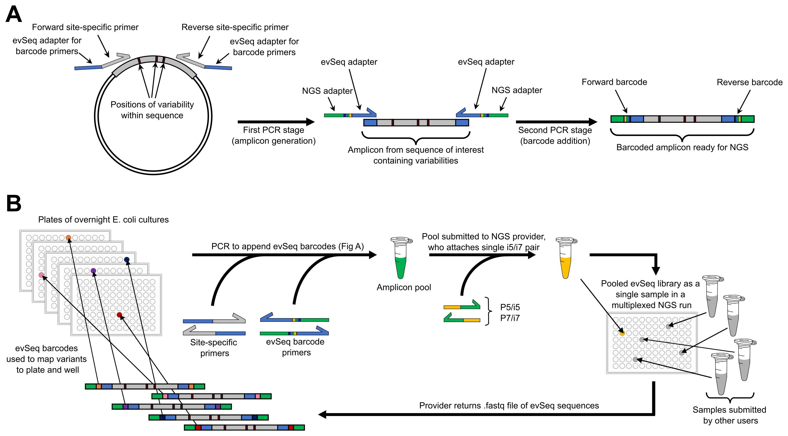
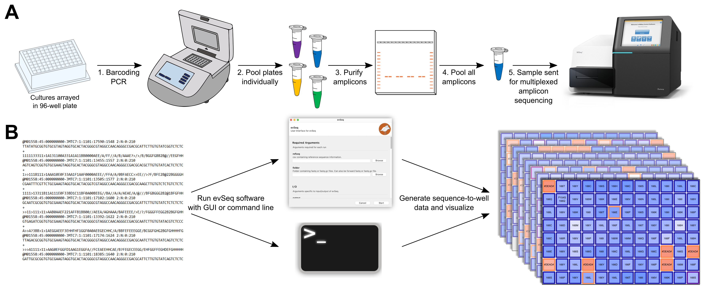
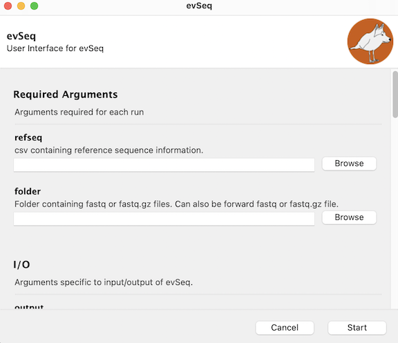

`evSeq`
=======
### *No sequence-function pair left behind.*
Every Variant Sequencing (`evSeq`) is a library preparation and analysis protocol that **slots neatly into existing workflows to enable extremely low-cost, massively parallel sequencing of protein variants**. Designed for heterologously expressed protein variants arrayed in 96-well plates (or similar), this workflow enables **sequencing all variants** produced during a protein engineering or biochemical mutagenesis experiment at a cost of **cents per variant**, even for labs that do not have expertise in or access to next-generation sequencing (NGS) technology.

### Read the Paper!
This repository accompanies the work ["evSeq: Cost-Effective Amplicon Sequencing of Every Variant in a Protein Library"](LINK_TO_PAPER). If you use this tool, please [cite us](LINK_TO_PAGE_WITH_CITATION_FORMATS).

### Read the Docs!
For detailed information and interactive walkthroughs, [read the docs at the `evSeq` website.](https://fhalab.github.io/evSeq/)

#### Quick links to common resources:
##### Biology
- [Inner Primer Design](https://fhalab.github.io/evSeq/1-lib_prep.html#inner-primer-design)
- [PCR Protocol](https://fhalab.github.io/evSeq/1-lib_prep.html#pcr-protocol)
- [PCR Product Purification](https://fhalab.github.io/evSeq/1-lib_prep.html#pcr-product-purification)

##### Computation
- [Installation](https://fhalab.github.io/evSeq/3-installation.html)
- [Inputs](https://fhalab.github.io/evSeq/4-usage.html)
    - [The `refseq` file](https://fhalab.github.io/evSeq/4-usage.html#the-refseq-file)
- [Outputs](https://fhalab.github.io/evSeq/5-outputs.html)
    - [`OutputCounts`](https://fhalab.github.io/evSeq/5-outputs.html#OutputCounts)
- [Running `evSeq` in a Jupyter Notebook](https://fhalab.github.io/evSeq/8-full_demo.html)

##### [Troubleshooting](https://fhalab.github.io/evSeq/9-troubleshooting.html)

### The `evSeq` workflow

**A)** `evSeq` amplifies out a region of interest that contains variability, attaches well-specific barcodes and adapters, and is ready for NGS.

**B)** All that's required to perform the `evSeq` laboratory procedure is:

- a 96-well thermalcycler
- standard PCR reagents and materials
- access to an NGS provider
- two 96-well plates of `evSeq` barcoding ("outer") primers
- a pair of region-specific `evSeq`-compatible ("inner") primers
- 96-well plate(s) of cultures containing DNA encoding protein variants
- a 12-channel 10 µL pipette is also helpful; robotic support could be developed to replace many manual pipetting steps

**That's it.**

Due to the two-primer, culture-based PCR methodology employed by `evSeq`, only a new pair of inner primers needs to be ordered when targeting new regions/sequences and no DNA isolation needs to be performed.

**C)** Once the sequences are returned by the NGS provider, the computational workup can be performed on a standard laptop by users with little-to-no computational experience.

The amplicons prepared with `evSeq` can yield nearly 1000 high-quality protein variant sequences for just the cost of the multiplexed NGS run (typically ~$100 from commercial sequencing providers and much less from in-house providers).

### Construct and visualize sequence-function pairs

Sequencing eight site-saturation libraries (768 wells) in a single `evSeq` run and combining this with activity data to create low-cost sequence-function data. **A)** Enzyme and active-site structure highlighting mutated residues. **B)** Heatmap of the number of identified variants/mutations ("counts") for each position mutated ("library") from processed `evSeq` data. **C)** Heatmap of the average activity ("normalized rate") for each variant/mutation in each library. **D)** Counts for a single library, also showing the number of unidentified wells. **E)** Activity for a single library, showing biological replicates. (Inset displays the mutated residue in this library.)

### Installation
*RECOMMENDED.* Use the `evSeq` environment:
```
git clone https://github.com/fhalab/evSeq.git
cd evSeq
conda env create -f envs/evSeq.yml
```
`evSeq` is then installed inside the environment and can be run as described below when the `evSeq` environment is active.

This also installs a shortcut to the GUI on your Desktop (which can then be moved, e.g., to an Applications folder) which will run `evSeq` in the proper environment simply with a double click (see [below](#gui)).

Alternatively, you may install `evSeq` directly from `PyPI` via:
```
pip install evSeq
```
The correct packages should be automatically installed and a GUI shortcut is also made, but this is not guaranteed to work as you update your packages/dependencies in the future.

### Updating
By default, `evSeq` is installed in non-dev mode. This means that changes to the code base on your computer will not be reflected come run-time. If you want an editable version of `evSeq`, install with the `evSeq_dev` environment (note, however, that this environment does not set exact versions of dependencies like the `evSeq` environment). We recommend installing in non-dev mode (i.e., using the `evSeq` environment). Finally, we also provide the `evSeq_general` environment file which is similar to `evSeq_dev` but does not install an editable version of `evSeq`. To update `evSeq` when installed in a non-dev environment, the environment must be recreated. The below commands will update `evSeq`. First, navigate the evSeq repository folder via command line and enter the below commands:

```
git pull
conda remove -n evSeq --all
conda env create -f envs/evSeq.yml
```

### Usage
#### Command Line
Thanks to `setuptools` `entry_points`, `evSeq` can be accessed from the command line after installation as if it were added to `PATH` by running:
```
conda activate evSeq
evSeq refseq folder --OPTIONAL_ARGS ARG_VALUE --FLAGS
```
where `refseq` is the .csv file containing information about the experiment described above and `folder` is the directory that contains the raw `.fastq` files (.gz or unzipped) for the experiment.

For information on optional arguments and flags, run
```
evSeq -h
```
or visit [the usage page](https://fhalab.github.io/evSeq/4-usage.html#optional-arguments).

#### GUI
`evSeq` is also installed with a GUI for greater accessibility. After installing `evSeq`, you will find a new shortcut/app/executable on your Desktop, which you can double-click to launch the evSeq GUI:



More can be read about it [here](https://fhalab.github.io/evSeq/4-usage.html#GUI).