ssSeq
=====
Site-Saturation Sequencing (ssSeq) is a library preparation technique for extremely low cost massively parallel sequencing of site-saturation libraries. This repository contains...

1. Install ssSeq software needed for data analysis post sequencing. Jump to [Installation](#Installation)
2. Run ssSeq software through either a graphic user interface (GUI) or command line. Jump to [Using ssSeq](#Using-ssSeq) and/or [Program Arguments](#Program-Arguments).
3. Understand the output generated by the ssSeq software. Jump to [Understanding ssSeq Output](#Understanding-ssSeq-Output).
4. Information and resources needed to prepare ssSeq libraries for next-gen sequencing. Jump to [Biological Protocols](#Biological-Protocols).
5. A theoretical overview of ssSeq. Jump to [Theoretical Overview](#Theoretical-Overview)

Table of Contents
-----------------
- [Installation](#Installation)
    - [Non-Programmers](#Non-Programmers)
        - [Installing Git](#Installing-Git)
        - [Installing Anaconda](#Installing-Anaconda)
        - [Opening a Terminal Window](#Opening-a-Terminal-Window)
        - [Construction of "GitRepos" Folder](#Construction-of-GitRepos-Folder)
    - [General Instructions](#General-Instructions)
        - [ssSeq Installation](#ssSeq-Installation)
        - [Conda Environment Setup](#Conda-Environment-Setup)
            - [Dependencies](#Dependencies)
        - [PATH Variable Setup](#Path-Variable-Setup)
        - [Post Installation](#Post-Installation)
- [Using ssSeq](#Using-ssSeq) 
    - [Working with the GUI](#Working-with-the-GUI)
    - [Working through Command Line](#Working-through-Command-Line)
    - [Example Data](#Example-Data)
    - [Troubleshooting](#Troubleshooting)
- [Understanding ssSeq Output](#Understanding-ssSeq-Output)
    - [Summaries](#Summaries)
        - [MaxInfo.csv](#MaxInfo.csv)
        - [VariantInfo.csv](#VariantInfo.csv)
        - [SummaryInfo.csv](#SummaryInfo.csv)
    - [Platemaps](#Platemaps) 
    - [Qualities](#Qualities)
    - [Alignments](#Alignments)
    - [AACountsFrequencies](#AACountsFrequencies)
    - [BPCountsFrequencies](#BPCountsFrequencies)
    - [ConsensusSequences](#ConsensusSequences)
    - [ssSeqLog](#LogFile)
- [Program Arguments](#Program-Arguments)
    - [Required Inputs](#Required-Inputs)
        - [refseq](#refseq)
            - [Default refseq](#Default-refseq)
            - [Detailed refseq](#Detailed-refseq)
        - [folder](#folder)
    - [Optional Arguments](#Optional-Arguments)
- [Biological Protocols](#Biological-Protocols)
    - [Inner Primer Design](#Inner-Primer-Design)
    - [Library Preparation](#Library-Preparation)
- [Theoretical Overview](#Theoretical-Overview)

# Installation
## Non-Programmers
This section details installation of high level dependencies: gitbash (Windows users), git, and anaconda. If you have installed and are familiar with these items, you can skip this section and move on to [General Instructions](#General-Instructions). Installation on Linux is not detailed here, as we just assume you know what you're doing. Once this section is completed, continue installation by moving to [General Instructions](#General-Instructions).

### Installing Git
Windows users: Install Git/Git Bash by following the instructions [here](https://www.stanleyulili.com/git/how-to-install-git-bash-on-windows/). Unless you know what you're doing, sticking to the default options during install is best. 

Mac users: Install Git by following the instructions [here](https://www.atlassian.com/git/tutorials/install-git). Some commands must be performed through the terminal. You can open a terminal by typing command + spacebar, then searching "Terminal"; opening the search result will give you a terminal window.

### Installing Anaconda
Anaconda is an open-source package managment framework for scientific computing with Python. For details, look at their website [here](https://www.anaconda.com/). All software that supports ssSeq is handled by the Anaconda package manager. See below for installation instructions on both Windows and Mac:

Windows users: Install Anaconda following the instructions [here](https://docs.anaconda.com/anaconda/install/windows/). At step 8, I recommend adding Anaconda to your PATH environment variable. Note that this is in contrast to the recommendation of Anaconda, but their concerns shouldn't apply for our use case.

Mac users: Install Anaconda following the instructions [here](https://docs.anaconda.com/anaconda/install/mac-os/). 

### Opening a Terminal Window
Later steps in our installation will require you to write commands in terminal. To open a terminal in Windows, right-click on either the desktop background or within your file explorer, then open "Git Bash". For Mac users, type command + spacebar, search "Terminal", then open the search result. 

### Construction of "GitRepos" Folder
The next step will be to install ssSeq. If you have not worked with Git repos before, I recommend creating a folder where you can store all of them. Wherever seems reasonable to you (most likely your home directory), create a folder called "GitRepos".

## General Instructions
### ssSeq Installation
Open a terminal window and navigate to your GitRepos folder. This is accomplished by entering the below command in the terminal

	cd PATH_TO_GIT_REPOS

For instance, in my case I would type

	cd /home/brucejwittmann/GitRepos

After hitting "Enter" on your keyboard, you will notice that the prefix of your command line has changed. It will look something like the below after successfully executing the "cd" command:

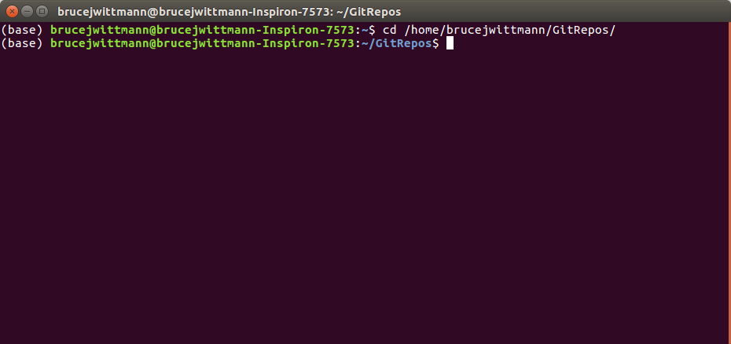

From the ssSeq GitHub page, find the green box labeled "Clone or download". A screenshot giving the box location is below. Click on this box, then copy the presented url. 

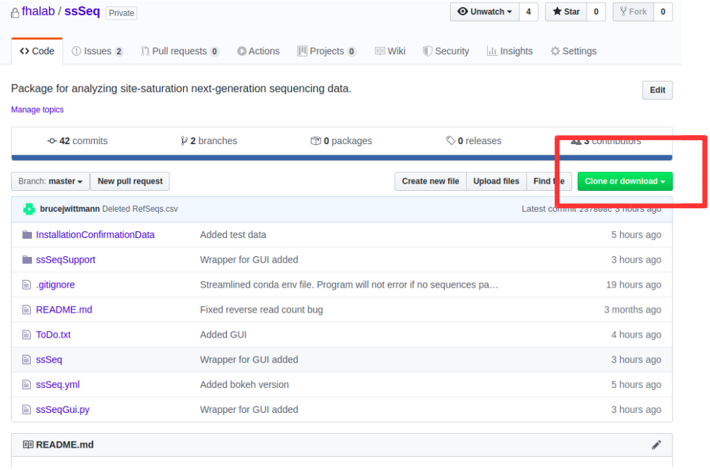

Now in the command line, type 

	git clone COPIED_URL

replacing "COPIED_URL" with the link you just copied from GitHub. You can paste the link into command line by right-clicking and selecting "paste". If you successfully installed Git earlier, then this should begin the installation process. 

### Conda Environment Setup
We will now set up the conda environment for ssSeq. This conda environment will neatly package all of the support software needed to run ssSeq. To begin, navigate to the ssSeq folder via the command line. On my machine, I would type 

    cd /home/brucejwittmann/GitRepos/ssSeq

Note that ssSeq was installed within my GitRepos folder. Depending on where you installed ssSeq you will need to navigate to a different folder. Next, type the command 

    conda env create -f ssSeq.yml

If you successfully installed conda earlier, then this command should run without problems. 

#### Dependencies
Advanced users: If you would rather not use the ssSeq environment and run in a custom environment (or, if you're a brave soul, your base environment), below are the ssSeq dependencies, all of which are available through conda. These dependencies are, of course, explicitly listed in the ssSeq.yml environment file. The explicit version call with bokeh handles an incompatibility between the most recent bokeh and holoviews versions at the time of writing (03/24/2020).

    # ssSeq without GUI
    - biopython
    - colorcet
    - holoviews
    - bokeh=1.4.0
    - numpy
    - pandas
    - python=3.7
    - tqdm
    - scipy
    
    # With GUI, also need:
    - gooey

### PATH Variable Setup
This step is optional. However, if you want to run ssSeq from anywhere on your computer then you should do it. For the uninitiated, your PATH variable contains the locations your computer will look for a program when you ambiguously tell it to run something. By putting the location of ssSeq in my PATH variable, this means I can run ssSeq from anywhere on my computer by just calling

    ssSeq

instead of having to call

    /home/brucejwittmann/GitRepos/ssSeq/ssSeq

Instructions for adding ssSeq to PATH are [here](https://helpdeskgeek.com/windows-10/add-windows-path-environment-variable/) for Windows, [here](https://www.architectryan.com/2012/10/02/add-to-the-path-on-mac-os-x-mountain-lion/#.Uydjga1dXDg) for Mac, and [here](https://askubuntu.com/questions/60218/how-to-add-a-directory-to-the-path) for Linux (Ubuntu). You should add the directory containing the ssSeq GitHub repository to your PATH variable. For me, this means I would add the below to PATH

    /home/brucejwittmann/GitRepos/ssSeq/

### Post Installation
Once installed, refer to [Working with the GUI](#Working-with-the-GUI) or [Working through Command Line](#Working-through-Command-Line), depending on your preference, for instructions for instructions on how to use ssSeq. Non-programmers will want to use the GUI. 

Once comfortable with the GUI or command line, example data can be found in [InstallationConfirmationData](./InstallationConfirmationData) for you to test your installation. The file "DefaultRefSeqs.csv" should be used as "refseq" and the whole folder should be used as "folder". Details on these arguments can be found in [Required Arguments](#Required-Arguments). Additional optional arguments can also be passed in to ssSeq; they are detailed in [Optional Arguments](#Optional-Arguments).

# Using ssSeq
## Working with the GUI
The GUI is designed for use by non-programming experts. If you are comfortable with a command line interface, that is the recommended way to use ssSeq. If using the GUI, make sure you check the log file after each run to check for warnings or errors encountered. See details on the log file [here](#ssSeqLog). 

When using the GUI, begin by opening a terminal window then activating the ssSeq conda environment as below

    conda activate ssSeq

On Windows, you may receive the below error the first time you try to activate an environment:

    CommandNotFoundError: Your shell has not been properly configured to use 'conda activate'.

The error can be fixed by entering the command

    conda init bash

and then repeating the 'conda activate' command. This step should fix the error permanently.

With the conda environment active, you can now launch the graphic user interface (GUI). There are two ways to launch ssSeq through the GUI:

1. If ssSeq was added to your PATH and ssSeqGui made executable (see [PATH Variable Setup](#PATH-Variable-Setup)), then the GUI can be opened by typing

        ssSeqGui

2. If ssSeq was not added to your PATH and is not executable, then you can activate the GUI by first navigating to the ssSeq git repo folder (installed above) through command line and explicitly invoking Python as below

        cd ssSEQ_LOCATION
        python ssSeqGui

where "ssSEQ_LOCATION" is the location in which you installed ssSeq. Executing either of the above commands will launch an instance of the GUI. It should look like the below:

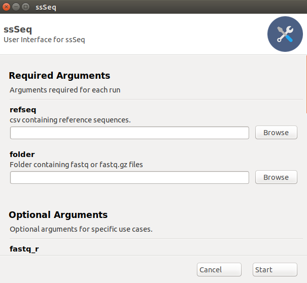

Note that the two required arguments are at the top of the GUI, details on these arguments can be found [here](#Required-Arguments). We can populate the fields with the test data given in [Example Data](#Example-Data), which will look like below:

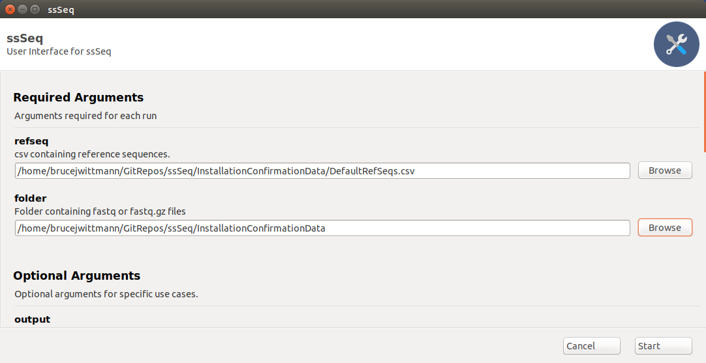

Note that "refseq" is a file while "folder" is a folder. For more advanced use, other arguments can be accessed by scrolling down (These additional arguments are detailed in [OptionalArguments](#Optional-Arguments).). You will typically not need these arguments, however, and the standard ssSeq run can be started by clicking "Start" once "refseq" and "folder" are populated. Once started, the progress of the program will be printed to the GUI along with any encountered warnings and errors.

## Working through Command Line
This is the recommended way to use ssSeq, as any warnings or errors encountered are printed directly to the terminal. Begin by opening a terminal window then activating the ssSeq conda environment as below

    conda activate ssSeq 

With the conda environment active, ssSeq can be run. There are two ways to launch ssSeq:
1. If ssSeq was added to your PATH and ssSeq made executable (see [PATH Variable Setup](#PATH-Variable-Setup)), then ssSeq can be run by typing

        ssSeq refseq folder OPTIONAL_ARGS FLAGS

2. If ssSeq was not added to your PATH and  is not executable, then you can run ssSeq by first navigating to the ssSeq git repo folder (installed above) through command line and explicitly invoking Python as below

        cd ssSEQ_LOCATION
        python ssSeq refseq folder OPTIONAL_ARGS FLAGS

In both of cases, "refseq" is the path to your reference sequence file and "folder" is the location of the folder with your fastq or fastq.gz files. Details on these required arguments can be found [here](#Required-Arguments). Optional arguments and flags are passed in after the two positional arguments. For information on the potential optional arguments and flags, type

    ssSeq -h

or

    python ssSeq -h

depending on whether or not you added ssSeq to PATH. The "-h" flag will pull up the help window detailing all possible ssSeq arguments. Note that these arguments are also detailed in [Optional Arguments](#Optional-Arguments). The help window will look like below:

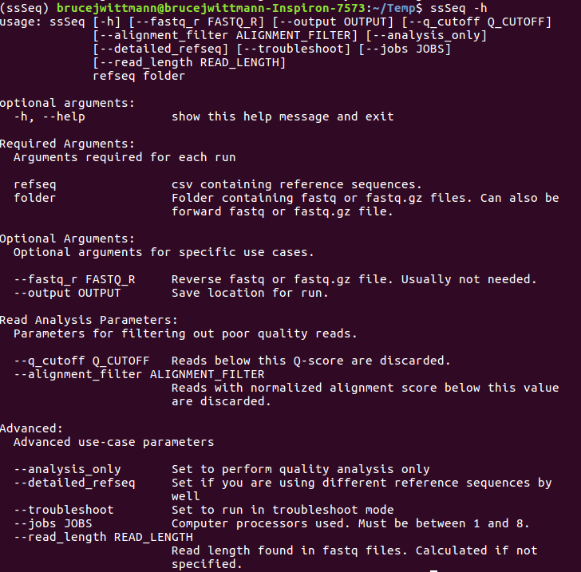

## Example Data
The folder [InstallationConfirmationData](./InstallationConfirmationData) contains an example reference sequence file and is itself an example folder containing fastq.gz files. This data can be used for confirming installation or just playing around with ssSeq. 

## Troubleshooting
### Permission Denied
If you receive a "permission denied error", you may also need to make the ssSeq run files executable. In Mac and Linux, accomplish this by first navigating to the ssSeq folder in command line. For instance, for me this is

    cd /home/brucejwittmann/GitRepos/ssSeq/

Once in the ssSeq folder, make both the GUI and command line versions executable by writing the below commands in command line

    chmod +x ssSeq
    chmod +x ssSeqGui

ssSeq should now be fully ready for your use.

### Improper Shell Configuration
On Windows, you may receive the below error the first time you try to activate an environment:

    CommandNotFoundError: Your shell has not been properly configured to use 'conda activate'.

The error can be fixed by entering the command

    conda init bash

and then repeating the 'conda activate' command. This step should fix the error permanently.

# Understanding ssSeq Output
The output location of ssSeq is controlled with the "output" optional argument (see [here](#Optional-Arguments)). If the "output" argument is not set, then ssSeq will save to the current working directory (command line) or the ssSeq Git repository folder (GUI). If the save location has not previously been used, then ssSeq will create a folder titled "ssSeq_Output" in the output location which contains a folder giving the date-time of the run initialization (in yyyymmdd-hhmmss format). If the save location has been previously used, then ssSeq will add another date-time folder with the previously generated ssSeq_Output folder. All ssSeq outputs of a specific run (except the log file) are contained in the associated date-time folder. The below sections detail the folders found within the date-time folder.

## Summaries
The summaries folder contains most tabular information needed for downstream processing after ssSeq. For each plate passed in via the "refseqs" file, 3 files will be generated and stored within the Summaries folder. The 3 files are "PREFIX_MaxInfo.csv", "PREFIX_SummaryInfo.csv", and "PREFIX_VariantInfo.csv", where PREFIX is the name of the plate given in the "refseqs" file. Each of these files shares the following headers:

| Header | Information Contained|
|:-------|----------------------|
| Plate | Index plate used |
| Well | Source plate/index plate well|
| F-BC | The forward barcode corresponding to the well|
| R-BC | The reverse barcode corresponding to the well|
| Aligment Frequency| The fraction of reads corresponding to VariantCombo or AA, depending on the specific file|
| WellSeqDepth | The number of reads with the specific VariantCombo or AA mapping to the well, again depending on the specific file|
| R1 | The forward read file used for processing |
| R2 | The reverse read file used for processing |

More detailed information on the contents of each file is found in the below subsections. Note that in all 3 files, if no reads were identified for a specific well, this well is omitted from the table.

### MaxInfo.csv
This file acts as the highest level tabular summary, reporting only the amino acid combination (or single mutant if not sequencing combinatorial libraries) with the highest alignment frequency. The heading "VariantCombo" gives this highest-frequency combination (in 5' -> 3' order, as passed in in the "refseqs" file). Care should be taken to review both the AlignmentFrequency and WellSeqDepth columns to gauge a measure of confidence in the variant combination identified. If either of these categories report low values, then the confidence in the call is low. Note that in the case where two variants are identified with equal frequency, both are reported in this file (so some wells may have multiple rows). 

### VariantInfo.csv
This file is the next highest level tabular summary, containing information on all identified variants as part of the ssSeq run. The information contained in this file is otherwise the same as that in MaxInfo.csv.

### SummaryInfo.csv
This file is the lowest level tabular summary, containing information on the specific sites mutagenesis sites passed in in the "refseqs" file. Unlike in MaxInfo.csv and VariantInfo.csv, sequencing information is decoupled here, meaning the information reported is agnostic to whether or not mutations were identified on the same sequencing read. As a result, the information reported gives the overall amino acid frequency identified at each mutagenized site as specified in the "refseqs" csv file. To report this information, SummaryInfo.csv has a few specific headers:

| Header | Information Contained|
|:-------|----------------------|
| ReadDirection | Whether the row corresponds to the forward or reverse read |
| Site | The id of the mutagenized position on the read |
| AA | The specific amino acid identified at the mutagenized position |

When analyzing combinatorial libraries, the information contained in MaxInfo.csv and VariantInfo.csv will typically be more informative. 

## Platemaps
For each plate passed in via the "refseqs" file, a single platemap image will be generated; these images are contained in html files found in the "Platemaps" folder, prefixed by the plate name. An example image is given below for a 4-site combinatorial library:

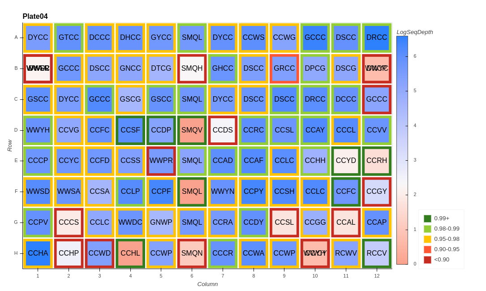

The text within each well is the combination of amino acids (in 5' -> 3' order, as passed in in the "refseqs" file) with the highest alignment frequency for that well. The fill color of the well is the log sequencing depth, while the well border color is the alignment frequency of the well. Note that the border color is binned rather than existing on a continuous scale. 

## Qualities
This folder contains histograms of the forward and reverse read quality scores for the sequencing run. For information on what the quality score is, see [here](https://www.illumina.com/content/dam/illumina-marketing/documents/products/technotes/technote_understanding_quality_scores.pdf) An example image from the "Qualities" folder is given below:

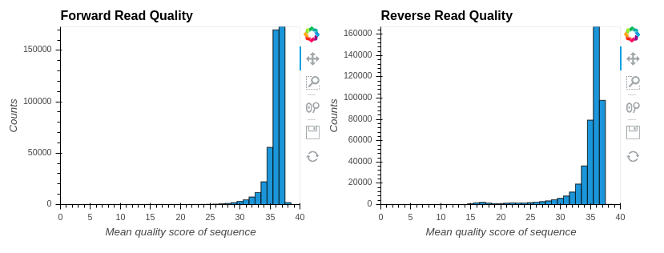

The example presented results from a good run -- as a heuristic, you typically want most reads above 30 in both the forward and reverse direction. Checking this file is critical, as it gives you insight into how confident you can be in your sequencing results. An example of a bad quality score histogram is below:

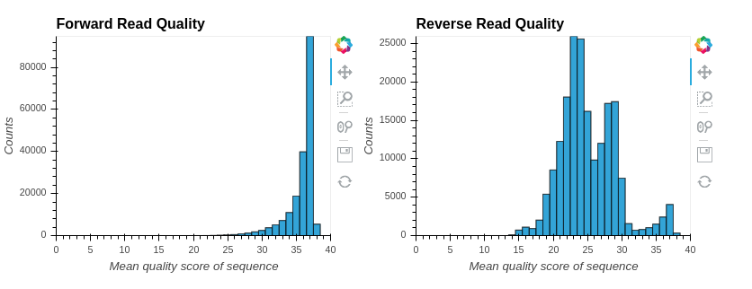

Note that most of the reverse reads have Q-scores below 30. If you have a histogram like this, it's highly likely that something went wrong at some stage of ssSeq library prep/sequencing. As of now, we don't know what causes histograms like this, so please keep track of your data and let us know when you see this!

## Alignments
This information is only generated when running in troubleshoot mode. For each plate passed in via the "refseqs" file, a text file containing every alignment made between the passed in reference sequences and the reads collected from next-gen sequencing is generated and stored in this folder.

The alignment file is ordered in blocks of forward and reverse reads for each well in the index plates. Each block is started by a series of "#" symbols, followed by a header specifying the index plate used, the well mapped, the forward barcode, the reverse barcode, and whether the forward or reverse alignments are reported in the block, all separated by "_" as a delimiter. 

The reference sequence used for alignment is always in the forward direction, truncated to the appropriate read length. The reverse complement of the reverse reads are reported rather than the reverse reads themselves.

## AACountsFrequencies
This information is only generated when running in troubleshoot mode. For each plate passed in via the "refseqs" file, a csv file containing the amino acid count and frequency matrices for each well is generated. 

The csv file is organized in alternating blocks of counts and frequencies of observing each amino acid at each position in the reference sequence. Each block is started by a header specifying the index plate used, the well mapped, the forward barcode, the reverse barcode, whether we are looking at a counts of frequencies matrix, and whether the matrix corresponds to the reverse or forward reads, all separated by "_" as a delimiter. Within each matrix, the rows correspond to an identified amino acid at that read position, while the columns correspond to the amino acid present at that read position in the reference sequence. For instance, if the column header is "Q" and the rows corresponding to "A" and "Q" have 2 and 50 counts, respectively, this indicates that 2 reads mapped to this well translated to put "A" at the expected position for "Q", while 50 reads translated to put the expected "Q" at the position giving "Q".

## BPCountsFrequencies
This information is only generated when running in troubleshoot mode. For each plate passed in via the "refseqs" file, a csv file containing the base pair count and frequency matrices for each well is generated. The format of these matrices is exactly the same as for the AACountsFrequencies matrices, only for the mapped base pairs rather than translated amino acids. 

## ConsensusSequences
This information is only generated when running in troubleshoot mode. For each plate passed in via the "refseqs" file, a text file containing the consensus sequence identified in both the forward and reverse directions of each well is reported. Currently, "consensus" is defined as having an alignment frequency greater than 90%. This parameter may become tunable in the future. If the 90% threshold is not met, then the consensus sequence is given an "N" 

## ssSeqLog
ssSeq keeps a log of every run. This is the only output not found in the generate date-time folder. Within the ssSeq Git repository folder, the log can be found here: ssSeqSupport/ssSeqLog.log. Information captured by the log file includes:

1. The start time of the ssSeq run, given as 'yyyymmdd-hhmmss' followed by a series of underscores. This is the first line of each log block.
2. The values of all parameters input to ssSeq. Note that if parameters are unspecified, the log records the default parameters.
3. Calculated parameters, including
    1. The forward and reverse read file pairs identified in the 'folder' argument
    2. Any files within 'folder' that were not matched. 
    3. The calculated read length for the run if read length was unspecified. Otherwise, the input read length.
4. Any warnings encountered during the run. These warnings will also be printed to the console during the run. 
5. Fatal errors. If the program completed successfully, the last line in the log entry will read "Run completed. Log may contain warnings."

The amount of information stored in the log file is small (bytes per run), but will build with continued use of ssSeq. If the file gets too large (this will take a long time...) you can delete ssSeqLog.log; on the next run a fresh ssSeqLog.log file will be instantiated.

# Program Arguments
## Required Arguments
The only two required arguments for ssSeq are a table giving the reference sequences for the expected amplicons ("refseq") and the folder containing the fastq files resulting from the sequencing run ("folder"). Both of these arguments are explained in detail below.

### refseq
This is a csv file outlining the expected amplicon sequence for a given plate or well. To construct a reference sequence:

1. Make a copy of your amplicon sequence. The sequence should include only that DNA pertaining to the target gene. In other words, adapter sequences should not be present, but binding regions for your primers should be. An example is given in the below image, where only the regions of NodSeq04 and NodSeq05 which bind to the gene of interest are taken as part of the amplicon (amplicon is highlighted); the remaining sequence of NodSeq04 and NodSeq05 is hidden and will not be taken as part of the amplicon.

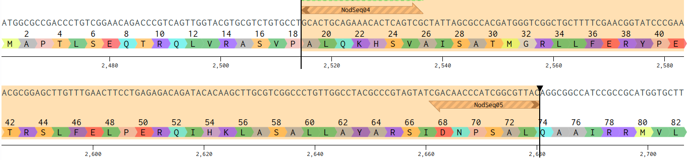

2. Replace the bases at the known mutagenized positions with "NNN" as the codon. This is given as an example again in the below image. Note that positions 29, 39, 49, and 63 are now given by "NNN" in the DNA sequence. ssSeq will search for "NNN" in the input reference sequences and identify those positions as the targets of site-saturation mutagenesis. Of course, for single site site-saturation mutagenesis, only 1 position would be given by "NNN", for double site site-saturation mutagenesis, 2 positions would be given by "NNN", and so on. 

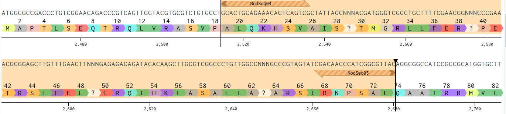

3. Using the "mutagenized" amplicon sequence (or sequences, depending on your use case), construct the csv file to pass in as the refseq argument. There are two different styles of refseq file that you can pass in, each detailed in the below subsections.

#### Default refseq
This form of the file assumes the same reference sequence in each well of the analyzed plates, and requires three columns: "PlateName", "IndexPlate", and "ReferenceSequence".These columns are detailed below:

| Column | Description |
|:-------|-------------|
| PlateName | This is a nickname given to the plate. For instance, if I performed ssSeq on a plate that I named "BJW_TestPlate01", I would write "BJW_TestPlate01" in this column. |
| IndexPlate | This is the ssSeq index plate used for library preparation corresponding to the plate in "PlateName". For instance, if I prepared "BJW_TestPlate01" using index plate 2, I would write "BJW_TestPlate01" in the "PlateName" column and "DI02" in the "IndexPlate" column. Allowed barcode names are DI01 through DI08. |
| ReferenceSequence | This is the reference sequence found in every well of "PlateName". This reference sequence is constructed following the instructions in the parent section of this section. |

As currently deployed, up to 8 plates (DI01 - DI08) can be input in a single ssSeq run. No more than 8 columns should thus ever be filled in this form of refseq. An example Default refseq format is given in the ssSeq GitHub repository [here](#./InstallationConfirmationData/DefaultRefSeqs.csv)

#### Detailed refseq
This form of the file allows for a different reference sequence in each well of the analyzed plates. In addition to the column headers given in [Default refseq](#Default-refseq), this form of the file has a "Well" column, enabling specification of a different reference sequence for each well in the input plates. As currently deployed, up to 8 plates (DI01 - DI08) can be input in a single ssSeq run, so no more than 768 columns should ever be filled in this form of refseq. An example Detailed refseq format is given in the ssSeq GitHub repository [here](#./InstallationConfirmationData/DetailedRefSeqs.csv).

When using this form of refseq, the detailed_refseq flag found in [Optional Arguments](#Optional-Arguments) must be set.

### folder
This is the folder containing the fastq or fastq.gz files generated during next-gen sequencing. Once activated, ssSeq will...

1. Look in this folder to find all filenames containing "\_R1\_" or "\_R2\_".
2. Match forward and reverse files by the name preceding the identified "\_R1\_" or "\_R2\_". For instance, the files "CHL1_S193_L001_R1_001.fastq.gz" and "CHL1_S193_L001_R2_001.fastq.gz" would be matched because the text preceding the "\_R1\_" and "\_R2\_", "CHL1_S193_L001", matches for both files. The file with the "\_R1\_" is designated the forward read file and the file with the "\_R2\_" is designated the reverse read file.
3. Pass the matched files into data processing.

Note that both files without a "\_R1\_" or "\_R2\_" in their name and files for which no matching partner is identified will be ignored; all ignored files are recorded in the [log file](#ssSeqLog). If multiple forward-reverse file pairs are identified, all pairs will be pushed into ssSeq using the same refseq file. If you need different refseq files for different ssSeq runs, then run separate ssSeq instances.

In special cases using ssSeq through command line, the forward read file can be passed in as the folder, and the reverse read file can be passed in as the optional argument "fastq_r". See the entry on "fastq_r" in the [Optional Arguments](#Optional-Arguments) section for more detail.

## Optional Arguments
There are a number of flags and optional arguments that can be thrown for ssSeq, all detailed in the table below:

| Argument | Type | Description |
|:---------|------|-------------|
| fastq_r | Argument | This argument is only available for command line use. If a case arises where, for whatever reason, ssSeq cannot auto-identify the forward and reverse read files, this option acts as a failsafe. Instead of passing the folder containing the forward and reverse files in to the "folder" required argument, pass in the forward read file as the "folder" argument and the reverse read file as this optional argument. |
| output | Argument | By default, ssSeq will save to the current working directory (command line) or the ssSeq Git repository folder (GUI). The default save location can be overwritten with this argument. |
| q_cutoff | Argument | As part of preprocessing, ssSeq discards any reads with an average quality score below this value. The default and recommended value is 30, though the threshold can be raised or lowered by entering different values. |
| alignemt_filter | Argument | ssSeq aligns each read found in the fastq files to the reference sequence and calculates an alignment score. All alignment scores are normalized to the maximum possible alignment score (i.e. a perfect alignment gets a score of "1"). Alignments with a score below this threshold are discarded and not used in later processing. The default value of 0.5 enables filtering out carried over primer from the library preparation stage, though the value can be raised or lowered for different filtering stringency. |
| analysis_only | Flag | Set this flag (check the box in the GUI) to only perform Q-score analysis on the input fastq files. The only output in this case will be the [quality score histograms](#Qualities). |
| detailed_refseq | Flag | Set this flag (check the box in the GUI) when passing in a detailed reference sequence file. See [Detailed refseq](#Detailed-refseq) for more information. |
| troubleshoot | Flag | Set this flag (check the box in the GUI) to perform ssSeq in troubleshoot mode. In addition to the standard output (see [Summaries](#Summaries), [Platemaps](#Platemaps), and [Qualities](#Qualities)), running in troubleshoot mode will also output [Alignments](#Alignments), [AACountsFrequencies](#AACountsFrequencies), [BPCountsFrequencies](#BPCountsFrequencies), and [ConsensusSequences](#ConsensusSequences). This detailed information can be used for identifying problems with ssSeq library prep and sequencing. |
| jobs | Argument | This is the number of processors used by ssSeq for data processing. By default, ssSeq uses 1 less processor than are available on your computer. As with all multiprocessing programs, it is typically not recommended to use all available processors unless you are okay devoting all computer resources to the task (e.g. you don't want to be concurrently checking email, playing music, running another program, etc.). The number of jobs can be lowered to reduce the memory demands of ssSeq. |
| read_length | Argument | By default, ssSeq will attempt to determine the read length from the fastq files. If this process is failing or you have some other reason for using a different read length than that in your fastq files, the read length can be manually set using this argument.

# Biological Protocols
The below sections detail the wet-lab protocols for generating ssSeq libraries. For a theoretical background on ssSeq library preparation please jump to [Theoretical Overview](#Theoretical-Overview).

## Inner Primer Design
This section details design of inner primers. It is assumed that you already have access to the outer primer dual indexing plates, which are currently managed by Bruce.

To use ssSeq, you need to amplify the region that you want to sequence as well as append barcode primers to the resultant amplicon. Your inner primers are thus made up of two parts: (1) a "seed" region which binds to the gene of interest and (2) a "tail" region which is acts as a universal adapter that outer, barcode primers can bind to and amplify off of. Follow the below to design your primers:

1. Identify the site (or sites) that you want to sequence.
2. Choose the priming sites and design your primer. Aim for a 58 C melting temperature, end on a G or a C, and check secondary structure! You need at least 6 bp open on the 3’ terminus of your primer for efficient priming. Keep in mind that the ssSeq sequence machinery takes up 27 bp of the forward read and 26 bp of the reverse read. For a 150 bp read, this thus means that the site that you want to sequence must be within 123 bp (223 for a 250 bp read) of the 5’-most extent of your forward primer, and 124 bp (224 for a 250 bp read) of the 5’-most extent of your reverse primer. 
3. Append the below adapter sequences to the 5’ terminus of your primers:

	F: 5’ - CACCCAAGACCACTCTCCGG – 3’
	R: 5’ - GGTAGACGGAGACAGGCGG – 3’

4. After you have appended the adapters, check secondary structure again to make sure you still have open binding sites on the complete primers. Your final primers will look something like the below

	F: 5’ - CACCCAAGACCACTCTCCGGXXXXXXXXXXXXXXXX – 3’
	R: 5’ - GGTAGACGGAGACAGGCGGXXXXXXXXXXXXXXXX – 3’

where "X" signifes the seed region binding to your target gene.
5. Once you have your primers in hand, you should run a test case to make sure that they work for ssSeq before using them to process full plates. You'll be very sad if you perform multiple plates of PCR only to find that they failed due to the inner primer. To check the inner primer, perform a single PCR reaction following the makeup given by the calculator [here](./LibraryPrepCalculators/PrimerFunctionalityCalculator.xlsx). Note that "inner primer" refers to a mixture of forward and reverse inner primer. Use the thermalcycler conditions given in [Library Preparation](#Library-Preparation).

Some things to keep in mind when designing primers:

1. Try to keep amplification fragments below 600 bp. You will notice fewer reads (and so can sequence less samples) if you start to go higher than this.
2. Reads are paired-end (see [here](https://www.biostars.org/p/314258/) for explanation), so your forward and reverse reads need not overlap; the computer will figure out what forward read goes with what reverse read. 
3. Reiteration: It is okay if your reads don't overlap. It is also okay if the center of the amplicon is not sequenced.
4. If you choose to overlap your forward and reverse reads, you get double the coverage at a position, which means greater confidence in your variant calls. Choosing whether or not to overlap forward and reverse reads is a tradeoff between sequencing depth at a target site and the number of sites that can be targeted with a single primer pair. 
5. The more samples you add to a run, the lower your coverage of each sample, and so the lower your confidence in your variant calls. 
6. If you design primers efficiently, you should be able to reuse the same sets for multiple different site-saturation positions.

## Library Preparation
This section details generation of an ssSeq library. It assumes you have already designed and ordered inner primers according to the protocol in the previous section. The stepwise library preparation protocol follows:

1. One day before library prepartion, begin overnight cultures of your plates of site-saturation library variants.
2. The next day, prepare Taq polymerase primary mastermix using the calculator found [here](./LibraryPrepCalculators/MastermixCalculator.xlsx). Note that "inner primer" refers to a 10 uM mixture of both the forward and reverse inner primers.
3. For each plate of variants you want to submit for sequencing:
    1. Add 7 uL of primary mastermix to each well of a half-skirted plate. Unless you are actively adding reagent, keep this place on ice until you put the plate in the thermalcycler
    2. Add 1 uL of overnight cell cultures to each well  
    3. Stamp (i.e. A01 primers into A01 PCR, A02 primers into A02 PCR, etc.) 2 uL of the dual indexed barcode plate into each well of the half-skirted plate
4. Seal the plates with thermalcycler-safe PCR film
5. Place the plates in thermalcyclers on the below conditions. "TD" means touchdown.

| Step | Temp (C)| Time |
|:-----|-----|------|
| 1 | 95 | 5 min |
| 2 | 95 | 20 s |
| 3 | TD 63 -> 53 | 20 s |
| 4 | 68 | 30 s |
| 5 | Return to 2, 10x |
| 6 | 95 | 20 s |
| 7 | 68 | 50 s |
| 8 | Return to 6, 25x |
| 9 | 68 | 5 min |
| 10 | 4 | Hold |

6. While the reactions run, prepare a large enough 2% agarose gel to accommodate all of your samples (you will be loading ~120 uL of product from each plate into a gel). The agarose gel must have Syber Gold added directly to it (Syber comes in 10000x, so add 1 uL/10 mL of gel) rather than added to the loading dye.
7. Once the reactions finish, if not immediately moving on to the next step, put the on ice.
8. Prepare DNA ladder by combining 10 uL 100 bp ladder (NEB), 70 uL ddH2O, and 16 uL loading dye without SDS.
9. Add 8 uL 10 mM EDTA (pH = 8.1) to 12 PCR tubes per plate. EDTA will be used to quench the reactions pre-pooling. Once you have started pooling reactions, you must be ready to immediately move on to the gel extraction step. **Do not pool reactions and let them sit.**
10. Row-wise, add 5 uL of completed PCR product to the tubes from step 6 (making 12 combined tubes per plate, 1 per column in the original plate). 
11. For each plate, combine 40 uL from each of the combinations made in the previous step to make 1 complete combination for the plate. 
11. To 100 uL of each pool, add 20 uL of gel loading dye ([NEB 6x Purple, No SDS](https://www.neb.com/products/b7025-gel-loading-dye-purple-6x-no-sds#Product%20Information)).
12. Load each pooled sample with gel to the agarose gel. Load 20 uL of the DNA ladder prepared earlier as reference. Immediately store the remaining pooled sample at -20 C.
13. Run the gel at 130 V until the dye bands have sufficiently migrated. You will get a gel that looks something like the below. The two central bands in the above image are representative 300 bp amplicon libraries. The bordering wells are blanks or ladders. The lower MW band is primer dimer. The more failed colonies that you have in a plate, the brighter this band will be. If your fragment is 150 bp, you will need to run a longer gel to separate the desired band from the primer dimer. It is critical to remove as much primer dimer as possible from your sample. **Primer dimer will dominate your sequencing and cause it to fail.**

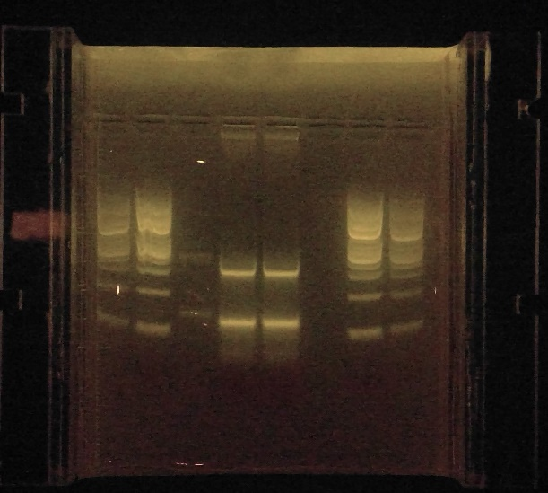

14. For each pool of variants, identify the desired band and excise it. Perform gel extraction (this method was developed using a [Zymoclean Gel DNA Recovery Kit](https://www.zymoresearch.com/collections/zymoclean-gel-dna-recovery-kits). Elution should be in ddH2O. 
15. Measure the DNA concentration of each gel extracted sample.
16. Finally, use the calculator found [here]() to create 15 uL at 5 ng/uL of combined pool of DNA of each of the plate samples. This is the sample that you will submit to multiplexed next-generation sequencing. 

# Theoretical Overview
