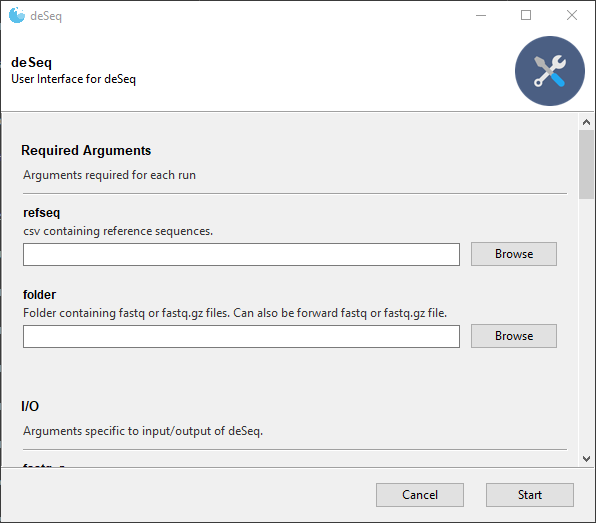
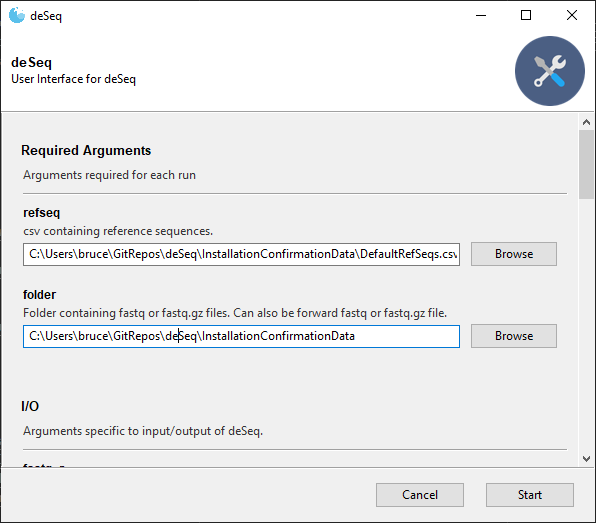

`evSeq`
=======
Every Variant Sequencing (`evSeq`) is a library preparation technique designed to slot neatly into existing protein engineering workflows to enable extremely low cost massively parallel sequencing of heterologously expressed protein variants arrayed in 96-well plates.

For detailed information, [read the docs at the `evSeq` website.](fhalab.github.io/evSeq/)

### General workflow


### Construct and visualize sequence-function pairs


### Installation
Simplest install with `pip`:
```
pip install evSeq
```

(RECOMMENDED) Or, to use the `evSeq` environment:
```
git clone https://github.com/fhalab/evSeq.git
cd evSeq
conda env create -f evSeq.yml
conda activate evSeq
```
`evSeq` is then installed inside the environment and can be run as described below when the `evSeq` environment is active.

### Usage
#### Command Line
Running `evSeq` from the command line is the most straightforward way to use the program. Thanks to `setuptools` `entry_points`, `evSeq` can be accessed from the command line after installation as if it were added to `PATH` by running:
```
evSeq refseq folder --OPTIONAL_ARGS ARG_VALUE --FLAGS
```
where `refseq` is the .csv file containing information about the experiment described above and `folder` is the directory that contains the raw `.fastq` files (.gz or unzipped) for the experiment.

For information on optional arguments and flags, run
```
evSeq -h
```
or visit [the usage page](fhalab.github.io/evSeq/comp/usage#optional-arguments).
### ^^ check links (also below)
#### GUI
`evSeq` is also installed with a GUI for greater accessibility, which can be read about [here](fhalab.github.io/evSeq/comp/usage#GUI).


------
------
# Old stuff


deSeq
=====
Directed-Evolution Sequencing (deSeq) is a library preparation technique for extremely low cost massively parallel sequencing of (multi- or single-site) site-saturation libraries and tile-based mutagenesis experiments. This library preparation technique enables sequencing all variants produced during a directed evolution experiment at a cost of cents per variant, even for labs that do not have expertise in or access to next generation sequencing technology. This repository contains...

1. Installation instructions for deSeq software needed for data analysis post sequencing. Jump to [Installation](#Installation).
2. Instructions for running deSeq software through either a graphic user interface (GUI) or command line. Jump to [Using deSeq](#Using-deSeq) and/or [Program Arguments](#Program-Arguments).
3. Information needed to understand the output generated by the deSeq software. Jump to [Understanding deSeq Output](#Understanding-deSeq-Output).
4. Information and resources needed to prepare deSeq libraries for next-gen sequencing. Jump to [Biological Protocols](#Biological-Protocols).
5. A theoretical overview of deSeq. Jump to [Theoretical Overview](#Theoretical-Overview).

Table of Contents
-----------------
- [`evSeq`](#evseq)
    - [General workflow](#general-workflow)
    - [Construct and visualize sequence-function pairs](#construct-and-visualize-sequence-function-pairs)
    - [Installation](#installation)
    - [Usage](#usage)
      - [Command Line](#command-line)
    - [^^ check links (also below)](#-check-links-also-below)
      - [GUI](#gui)
- [Old stuff](#old-stuff)
- [deSeq](#deseq)
  - [Table of Contents](#table-of-contents)
- [Using deSeq](#using-deseq)
  - [Launching the GUI](#launching-the-gui)
    - [Open GUI with Double-Click](#open-gui-with-double-click)
      - [Windows Users:](#windows-users)
      - [Mac users](#mac-users)
    - [Open GUI with Command Line](#open-gui-with-command-line)
  - [Running deSeq with the GUI](#running-deseq-with-the-gui)
  - [Working through Command Line](#working-through-command-line)
  - [Example Data](#example-data)
  - [Troubleshooting](#troubleshooting)
    - [Permission Denied](#permission-denied)
    - [Improper Shell Configuration](#improper-shell-configuration)
    - [Adding `conda` and `python` to path for Windows users who had already installed python](#adding-conda-and-python-to-path-for-windows-users-who-had-already-installed-python)
  - [Motivation](#motivation)
  - [Molecular Biology](#molecular-biology)


# Using deSeq
## Launching the GUI
The GUI is designed for use by non-programming experts. If you are comfortable with a command line interface, that is the recommended way to use deSeq. If using the GUI, make sure you check the log file after each run to check for warnings or errors encountered. See details on the log file [here](#deSeqLog).

The GUI can be opened either by double-clicking or command line on Windows and Mac. Options for both are below. The GUI is not currently available for use on Linux.

### Open GUI with Double-Click
The GUI can be launched with a simple double-click after a little more setup. Enable double-clicking as follows:

#### Windows Users:

1. Right click on the `deSeqGuiLauncher.py` file and select 'Open with' > 'Choose another app'. If you see Python as an option, check the box 'Always use this app to open .py files' then select Python. From now on, you should be able to launch the GUI by double-clicking the file and you are done and do not need to follow any more steps.
2. However, Python likely won't be an option. In this case start by opening GitBash and typing:

        where python

3. This will return the location of python on your computer. For example, your path is likely something like `C:\Users\<your username>\Anaconda3\python.exe`. This tells you where to find Python!
4. Return to `deSeqGuiLauncher.py` and select 'Open with' > 'Choose another app'. Check the box 'Always use this app to open .py files' then scroll down the list of apps, choose 'More apps' and then 'Look for another app on this PC'. This will bring you to a file browser. Using the file path you found above in GitBash, locate the `python.exe` file, select it, then click 'Open'.
5. Now you should be able to launch `deSeqGuiLauncher.py` with a double-click.

#### Mac users

1. First change the file extension of `deSeqGuiLauncher.py` to `.command` by navigating to the `deSeq/` directory and running in the terminal command line:

        mv deSeqGuiLauncher.py deSeqGuiLauncher.command

2. Make the file executable by then running:

        chmod +x deSeqGuiLauncher.command

3. Now you should be able to launch `deSeqGuiLauncher.command` with a double-click.

### Open GUI with Command Line
Begin by opening a terminal window. If deSeq was added to your PATH and deSeqGuiLauncher.py made executable (see [PATH Variable Setup](#PATH-Variable-Setup)), then the GUI can be opened by typing

        deSeqGuiLauncher.py

If deSeq was not added to your PATH and is not executable, then you can activate the GUI by first navigating to the deSeq git repo folder (installed above) through command line and explicitly invoking Python as below

        cd deSEQ_LOCATION
        python deSeqGuiLauncher.py

## Running deSeq with the GUI
Once the GUI is launched it should look like the below:



Note that the two required arguments are at the top of the GUI, details on these arguments can be found [here](#Required-Arguments). We can populate the fields with the test data given in [Example Data](#Example-Data), which will look like below:



Note that "refseq" is a file while "folder" is a folder. For more advanced use, other arguments can be accessed by scrolling down (These additional arguments are detailed in [OptionalArguments](#Optional-Arguments).). You will typically not need these arguments, however, and the standard deSeq run can be started by clicking "Start" once "refseq" and "folder" are populated. Once started, the progress of the program will be printed to the GUI along with any encountered warnings and errors.

## Working through Command Line
This is the recommended way to use deSeq as any warnings or errors encountered are printed directly to the terminal. Begin by opening a terminal window then activating the deSeq conda environment as below

    conda activate deSeq

With the conda environment active, deSeq can be run. There are two ways to launch deSeq:
1. If deSeq was added to your PATH (see [PATH Variable Setup](#PATH-Variable-Setup)), then deSeq can be run by typing

        deSeq refseq folder OPTIONAL_ARGS FLAGS

2. If deSeq was not added to your PATH or is not executable, then you can run deSeq by first navigating to the deSeq git repo folder (installed above) through command line and explicitly invoking Python as below

        cd deSeq_LOCATION
        python deSeq refseq folder OPTIONAL_ARGS FLAGS

In both of cases, "refseq" is the path to your reference sequence file and "folder" is the location of the folder with your fastq or fastq.gz files. Details on these required arguments can be found [here](#Required-Arguments). Optional arguments and flags are passed in after the two positional arguments. For information on the potential optional arguments and flags, type

    deSeq -h

or

    python deSeq -h

depending on whether or not you added deSeq to PATH. The "-h" flag will pull up the help window detailing all possible deSeq arguments. Note that these arguments are also detailed in [Optional Arguments](#Optional-Arguments). 

## Example Data
The folder [InstallationConfirmationData](./InstallationConfirmationData) contains an example reference sequence file and is itself an example folder containing fastq.gz files. This data can be used for confirming installation or just playing around with deSeq.

## Troubleshooting
### Permission Denied
If you receive a "permission denied error", you may also need to make the deSeq run files executable. In Mac and Linux, accomplish this by first navigating to the deSeq folder in command line. For instance, for me this is

    cd /home/brucejwittmann/GitRepos/deSeq/

Once in the deSeq folder, make both the GUI and command line versions executable by writing the below commands in command line

    chmod +x deSeq
    chmod +x deSeqGui
    chmod +x deSeqGuiLauncher.py

deSeq should now be fully ready for your use.

### Improper Shell Configuration
On Windows, you may receive the below error the first time you try to activate an environment:

    CommandNotFoundError: Your shell has not been properly configured to use 'conda activate'.

The error can be fixed by entering the command

    conda init bash

and then repeating the 'conda activate' command. This step should fix the error permanently.

### Adding `conda` and `python` to path for Windows users who had already installed python
On Windows, if you had installed conda previously, GitBash may not recognize `conda` or `python` as allowed commands. You can check if this is you by trying to run the following:

    conda --version

    python --version

If these commands work and print your versions this is not your problem. If you get an error, use the website found [here](https://www.datacamp.com/community/tutorials/installing-anaconda-windows) to solve this issue. Search for the section 'Add Anaconda to Path (Optional)' and if you need more clarification for how to add directories to your path, you can use the website [here](https://helpdeskgeek.com/windows-10/add-windows-path-environment-variable/).


## Motivation
Traditional directed evolution experiments require limited, if any, sequencing in order to be successful. When sequencing is performed for DE, Sanger sequencing is usually the method of choice, despite competing sequencing methods returning greater information content. This preference likely stems from the ease with which Sanger sequencing can be performed, the simplicity of Sanger sequencing data analysis, and the lower cost of outsourcing Sanger sequencing to commercial sequencing companies. The cost of Sanger sequencing scales linearly with the number of samples, however, so while the cost of sequencing a few variants in traditional DE is minor, sequencing the hundreds or thousands of protein variants generated during a MLDE experiment rapidly becomes cost-prohibitive for most laboratories.

An alternate sequencing approach to Sanger is next-generation sequencing (NGS) Unlike Sanger sequencing, whose output is a single read of DNA, a single NGS run outputs millions of individual DNA reads, equivalent to a random sample from the input population of DNA. A single NGS run is roughly three orders of magnitude more expensive than a Sanger sequencing run, but molecular biology methods relying on molecular barcoding have been developed to spread reads from an NGS run -- and hence the cost of the run -- over a set of samples. Molecular barcoding involves incorporating a unique piece of DNA, the barcode, with a known sequence into a sample. This barcoded sample can then be combined with a set of other uniquely barcoded samples before being pooled and sequenced in the same NGS run, a process known as “multiplexed sequencing”. After sequencing is complete, the barcodes are used to deconvolute the sequences, and individual sequences are assigned to specific samples. Current commercially available kits allow for multiplexed sequencing of up to 96 samples, yielding tens to hundreds of thousands of individual sequences per sample. For labs that do not produce large quantities of samples for sequencing, commercial sequencing providers will charge around $80 per sample for a spot in a multiplexed sequencing run.

Unfortunately, multiplexed sequencing with 96 samples is still an order of magnitude more expensive per sample than a single Sanger run, and so is also impractical for use in sequencing DE variants. Notably, however, the sequencing depth generated from a 96-barcode multiplexed sequencing run is much greater than what is needed for sequencing variants from MLDE experiments, where the individual samples sequenced are (ideally) monoclonal and the locations of mutations are generally known. Recognizing this unneccessary depth, deSeq employs an inline barcoding approach to further spread the reads from multiplexed NGS over an even greater number of samples, further decreasing the per-sample sequencing cost. *Using this inline barcoding approach, deSeq enables sequencing of up to 8 plates of variants at a total cost of $80 (when outsourcing to commercial sequencing companies), 10.4 cents per variant, ~130 reads per variant. Because the actual sequencing step can be outsourced, deSeq is available to all labs, whether or not they have directe access to NGS.*

## Molecular Biology
deSeq focuses the reads generated during NGS to DNA regions known to contain mutations (e.g. from site-saturation mutagenesis). The general procedure for deSeq for a single variant (e.g. one well in a plate) is shown in the below figure.


The above figure depicts a nested PCR, which is a *single* experimental step; it is broken down in the image for clarity. Mechanistically, this nested PCR works as follows:

1. To begin, inner primers specific to the region of DNA known to contain mutations bind. Because these primers are specific to a target gene fragment, a different set must be designed by the user for each target region.
2. In addition to the gene-specific region, the inner primers also contain a universal adapter "tail". These universal adapters are the same for each set of inner primers, and allow reuse of the same inline barcode primers (next step) regardless of the target DNA.
3. PCR using the inner primers generates an amplicon containing both the variable regions and ends with universal sequences. Inline barcoding primers designed to be complementary to the universal sequences can then bind and further extend the amplicon. Importantly, the combination of forward and reverse inline barcodes is unique for each variant. The inline barcoding primers (also refered to as the "outer primers") also contain adapters for feeding the generated amplicon into multiplexed NGS sequencing.
4. After step 3, deSeq is complete for most labs. Addition of the adapters for multiplexed NGS sequencing allows the actual sequencing step to be outsourced.

Of course, the above steps detail the reaction for a single variant. The full deSeq library preparation protocol performs the above steps for every target variant. The bigger picture workflow is depicted in the below figure:


The above image depicts deSeq library prep for one plate, but the process is easily scaled to more than one plate just by using more than 96 barcode combinations (because there are 96 unique forward and reverse barcodes, 96^2 = 9604 are possible in theory, though in practice read depth often becomes too low after 10 plates are multiplexed). In step 1 in the above image, PCR is performed for all variants in a plate (or set of plates, depending on how many variants the user has), and inline barcoding is performed based on the position of each variant in a plate. Post PCR, the amplicons generated from the full plate are pooled and purified via gel extraction. At this point, the pool of amplicons is outsourced to a third party sequencing company, where a single Illumina barcode is attached to the pool using the illumina adapter sequences attached during the barcoding step. The pool is then run as a single sample in a multiplexed NGS run.

Once sequencing is complete, the third party sequencing company will return fastq or fastq.gz files to the submitter. These files contain a list of all sequences identified during NGS. Using the deSeq software detailed in this repository, the list of sequences is programmatically mapped back to the original plate locations based on the unique combination of inline barcodes. From these deconvoluted sequences, the variant identity in each well of the submitted plate(s) is identified.