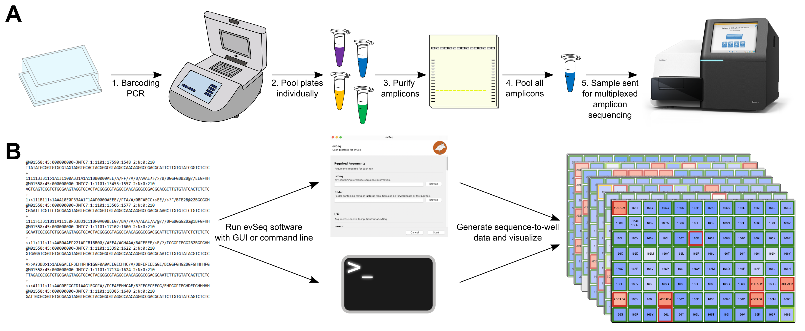

`evSeq`
=======
Every Variant Sequencing (`evSeq`) is a library preparation technique designed to slot neatly into existing protein engineering workflows to enable extremely low cost massively parallel sequencing of heterologously expressed protein variants arrayed in 96-well plates.

For detailed information, [read the docs at the `evSeq` website.](fhalab.github.io/evSeq/)

### General workflow

**A)** Laboratory procedure. **B)** Computational procedure.

### Construct and visualize sequence-function pairs

Sequencing eight site-saturation libraries (768 wells) in a single `evSeq` run and combining this with activity data to create low-cost sequence-function data. **A)** Enzyme and active-site structure highlighting mutated residues. **B)** Heatmap of the number of identified variants/mutations ("counts") for each position mutated ("library") from processed `evSeq` data. **C)** Heatmap of the average activity ("normalized rate") for each variant/mutantion in each library. **D)** Counts for a single library, also showing the number of unidentified wells. **E)** Activity for a single library, showing biological replicates. (Inset displays the mutated residue in this library.)

### Installation
*RECOMMENDED.* Use the `evSeq` environment:
```
git clone https://github.com/fhalab/evSeq.git
cd evSeq
conda env create -f evSeq.yml
```
`evSeq` is then installed inside the environment and can be run as described below when the `evSeq` environment is active.

This also installs a shortcut to the GUI on your Desktop (which can then be moved, e.g., to an Applications folder) which will run `evSeq` in the proper environment simply with a double click (see [below](#gui)).

Alternatively, you may install `evSeq` directly from `PyPI` via:
```
pip install evSeq
```
The correct packages should be automatically installed and a GUI shortcut is also made, but this is not guaranteed to work as you update your packages/dependencies in the future.

### Usage
#### Command Line
Running `evSeq` from the command line is the most straightforward way to use the program. Thanks to `setuptools` `entry_points`, `evSeq` can be accessed from the command line after installation as if it were added to `PATH` by running:
```
evSeq refseq folder --OPTIONAL_ARGS ARG_VALUE --FLAGS
```
where `refseq` is the .csv file containing information about the experiment described above and `folder` is the directory that contains the raw `.fastq` files (.gz or unzipped) for the experiment.

For information on optional arguments and flags, run
```
evSeq -h
```
or visit [the usage page](fhalab.github.io/evSeq/comp/usage.html#optional-arguments).

#### GUI
`evSeq` is also installed with a GUI for greater accessibility. After installing `evSeq`, you will find a new shortcut/app/executable on your Desktop, which you can double-click to launch the evSeq GUI:


More can be read about it [here](fhalab.github.io/evSeq/comp/usage.html#GUI).