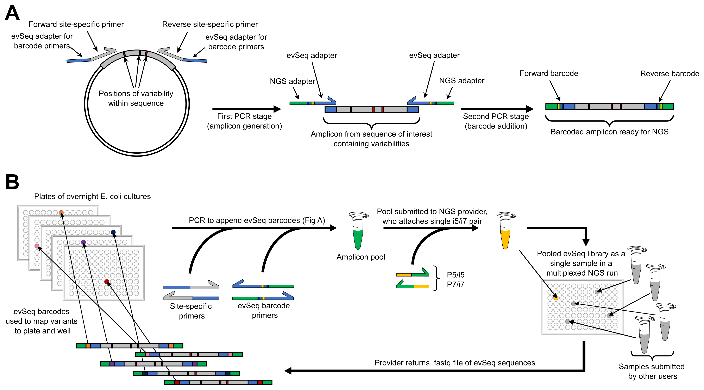

# Library Preparation

## General Protocol
The general protocol is as follows:
1. Design and order primers that flank your region-of-interest and will generate a NGS-suitable amplicon. [Jump to Inner Primer Design](#inner-primer-design) for more details, but the general design constraints are listed below.
    - A suitable amplicon is one that is 600 bp or fewer and is thus compatible with the dowstream NGS processing.
    - It should also contain all variability within the region that will be sequenced during the NGS run: for example, if using a paired-end 150 (PE150) protocol, the variable regions should be ~150 bp from each end of the amplicon. (The exact length is a little less, as the `evSeq` machinery takes up some of the read; see [below](#inner-primer-design).)
    - The reads do not need to overlap nor does the entire amplicon need to be sequenced.
    - These primers should include the appropriate `evSeq` adapter sequences as well (shown in blue above and specified [here](#adapters)).
2. Use culture from a 96-well plate outgrowth (an "overnight" culture) to perform a 96-well PCR with these primers. [Jump to PCR Protocol.](#pcr-protocol)
    - Multiple 96-well plates can be combined in a single `evSeq` run.
    - The plasmid within the cells in each culture will act as the template for the PCR.
    - After initial amplicon generation (~10 cycles), add the `evSeq` barcode primers to append plate- and well-specific barcodes to each amplicon.
3. Pool each well of the PCR plate together, purify, and then send for a paired-end NGS run. [Jump to PCR Product Purification.](#pcr-product-purification)
    - Multiple purified `evSeq` samples can be further pooled together if using different pairs of `evSeq` dual-index barcode plates (barcode plates DI01–DI08). This further spreads the NGS reads (and cost) among more variants, allowing up to 768 wells to be sequenced in a single multiplexed NGS experiment.
    - Each plate should be purified individually, then their concentrations normalized and then pooled together as a single sample.
4. Work up the .fastq files with the `evSeq` software, which maps the barcodes back to their original plate-well positions. [Jump to the Computation resources.](index.md#computation)

## Dual-Index Barcode Plates
Barcoded amplicons are mapped back to wells using their forward and reverse (dual-indexed) barcode sequences. To reduce costs, `evSeq` uses only two plates of unique barcode (or "outer") primers—one for the forward primers and one for the reverse—which are combined in different ways to create eight possible dual-indexed (DI) primer plates.

The sequences in each well of the Forward and Reverse barcode (FBC and RBC, respectively) plates can be found [on this sheet](https://github.com/fhalab/evSeq/blob/master/lib_prep_tools/evSeq_barcode_primer_seqs.csv).

Each of the eight DI plates are created by combining the FBC rows with a different set of RBC rows according to the following scheme:
1. Every DI plate is stamped (A01 -> A01, etc.) directly with the FBC plate.
2. Row A of the RBC plate goes into the *N*th row (A=1, B=2, etc.) of plate DI0*N*, and the rest of the rows are shifted similarly.
   1. *E.g.*, RBC Row A goes into DI02 Row B, DI03 Row C, ..., DI08 Row H, while RBC Row B gies into DI02 Row C, DI03 Row D, ..., DI08 Row A.
   2. DI01 is simply the exact combination of the FBC and RBC plates.

This operation creates pairings that look like this:

| DI Plate | DI Plate Row | FBC Row | RBC Row |
|-------|:---------:|:--------------:|:--------------:|
| DI01 | A | A | A |
| DI01 | B | B | B |
| DI01 | C | C | C |
| ... | ... | ... | ... |
| DI01 | H | H | H |
| ... | ... | ... | ... |
| DI02 | A | A | H |
| DI02 | B | B | A |
| DI02 | C | C | B |
| ... | ... | ... | ... |
| DI02 | H | H | G |
| ... | ... | ... | ... |

such that the barcode pair in `DI01-A01` is `F_A01` + `R_A01`, whereas the barcode pair in `DI02-A01` is `F_A01` + `R_H01`, etc. This information is an integral part of the `evSeq` package and can be found [here](https://github.com/fhalab/evSeq/blob/master/evSeq/util/index_map.csv), but should not need to be edited in any way if following the procedures described here. However, for different use cases, [tools are provided](7-index_mapping.html) to create and validate new DI plates.

## Inner Primer Design
This section details design of inner primers. It is assumed that you already have access to the outer primer dual-indexing plates described above.

To use `evSeq`, you need to amplify the region that you want to sequence as well as append barcode primers to the resultant amplicon. Your inner primers are thus made up of two parts: (1) a "seed" region which binds to the gene of interest and (2) the "adapter" region which allows the outer, barcode primers to bind and amplify to attach the barcodes. Follow the below to design your primers:

1. Identify the region that you want to sequence that contains variability.
2. Choose the priming sites and design your primer. Aim for a 58 °C melting temperature, end on a G or a C, and check secondary structure! You want at least 6 bp open on the 3’ terminus of your primer for efficient priming. **Keep in mind that the `evSeq` sequence machinery takes up 27 bp of the forward read and 26 bp of the reverse read.** This comes from the adapters (20 and 19 bp, see below) and the barcodes (7 bp). For a 150 bp read, this means that the sites that you want to sequence must be within 123 bp (223 for a 250 bp read) of the 5’-most extent of your forward primer seed, and 124 bp (224 for a 250 bp read) of the 5’-most extent of your reverse primer seed.
3. Append the below adapter sequences to the 5’ terminus of your primers:

<a id="adapters"></a>
```
F: 5’ - CACCCAAGACCACTCTCCGG – 3’ 
R: 5’ - CGGTGTGCGAAGTAGGTGC – 3’
```

4. After you have appended the adapters, check secondary structure again to make sure you still have open binding sites on the complete primers. Your final primers will look something like the below:

```
F: 5’ - CACCCAAGACCACTCTCCGGXXXXXXXXXXXXXXXX – 3’
R: 5’ - CGGTGTGCGAAGTAGGTGCXXXXXXXXXXXXXXXX – 3’
```

where `X` signifies the seed region binding to your target gene.

1. Once you have your primers in hand, you should run a test case to make sure that they work for `evSeq` before using them to process full plates. The procedure given below in [PCR Protocol](#pcr-protocol) can be scaled down to handle one or a few wells for testing purposes, as described in [Inner Primer Test PCR](#inner-primer-test-pcr).

<a id="tips-and-tricks"></a>
### Some things to keep in mind when designing primers:

1. Try to keep amplification fragments below 600 bp. You will notice fewer reads (and therefore can sequence fewer samples) if you start to go higher than this.
2. Reads are paired-end (see [here](https://www.biostars.org/p/314258/) for explanation), so your forward and reverse reads need not overlap; the computer will figure out what forward read goes with what reverse read.
3. Reiteration: It is okay if your reads don't overlap. It is also okay if the center of the amplicon is not sequenced.
4. If you choose to overlap your forward and reverse reads, you get double the coverage at a position, which means greater confidence in your variant calls. Choosing whether or not to overlap forward and reverse reads is a tradeoff between sequencing depth at a target site and the number of sites that can be targeted with a single primer pair.
5. The more samples you add to a run, the lower your coverage of each sample, and so the lower your confidence in your variant calls.
6. If you design primers efficiently, you should be able to reuse the same sets for multiple different gene regions.

## PCR Protocol
This section details generation of an `evSeq` library, including the one-pot two-step PCR needed to append inline barcodes (note that the PCR can also be performed as one-pot, one-step by adding both sets of primers together, though we have seen greater success rates with the two-step approach). It assumes you have already designed and ordered inner primers according to the protocol in the previous section as well as have access to dual indexed barcode plates. In addition to these, you will need the following materials (links are provided to the specific products we used where possible).

### Materials
- Double-distilled/PCR-grade water (ddH2O)
- [Taq polymerase](https://www.neb.com/products/m0267-taq-dna-polymerase-with-thermopol-buffer#Product%20Information)
- [ThermoPol Buffer (10X)](https://www.neb.com/products/b9004-thermopol-reaction-buffer#Product%20Information)
- DMSO (100%)
- dNTPs (10 mM)
- Inner Primer Mix (10 µM *each* primer)
- Half-skirted PCR plates
- [Thermalcycler-safe PCR sealing film](https://www.bio-rad.com/en-us/sku/msb1001-microseal-b-pcr-plate-sealing-film-adhesive-optical?ID=msb1001)
- Dual-Index `evSeq` Barcode Plates (1 µM each primer)
- EDTA solution (10 mM, pH 8.1)
- [NEB Purple Gel Loading Dye, No SDS (6X)](https://www.neb.com/products/b7025-gel-loading-dye-purple-6x-no-sds#Product%20Information)
- 2% Agarose Gel
- [SYBR Gold Dye (10,000X)](https://www.thermofisher.com/order/catalog/product/S11494#/S11494)
- [NEB 100 bp Ladder](https://www.neb.com/products/n3231-100-bp-dna-ladder)
- [Gel DNA Recovery Kit](https://www.zymoresearch.com/collections/zymoclean-gel-dna-recovery-kits)

You will also need overnight culture to use as template for the PCR. The culture may be either fresh overnight culture (i.e., used the morning after inoculation) or frozen and thawed before use. Decreases in PCR efficiency are seen the longer the overnight culture is at temperatures above freezing; multiple freeze-thaw cycles have minimal effect on PCR efficiency, presumably because the template plasmid in the media stays intact, even if the cells do not.

### Inner Primer Test PCR
As stated in the previous section, it is recommended that you test the inner primers in a single PCR to confirm that they perform the first step of amplification properly. You should perform this reaction using overnight culture containing a suitable template (e.g., cells containing your parent plasmid). If this test works, the full plate protocol with the barcodes _should_ work. However, if this test works and the barcode PCR does not work, or if you want to confirm that the barcode PCR with definitely work, you may use the outer barcodes as well, either in a one-step or two-step PCR. (For the two-step PCR, follow the thermal cycle shown in the [full protocol](#full-protocol) below.)

#### Mastermix
First, make a mastermix suitable for 100 µL (total) of PCR tests:

| Reagent | Volume (µL) |
|:-------:|:-----------:|
| ddH2O | 48.24 |
| ThermoPol | 14.4 |
| DMSO | 5.76 |
| dNTPs | 2.88 |
| Taq | 0.72 |

Next, in order to accurately pipette your inner primer mix in such a small reaction volume, you should prepare a 0.1 µM stock of these primers (0.1 µM *each*).

#### Single PCR preparation
Prepare your PCR according to the following ratios:
- 5 parts mastermix
- 2 parts 0.1 µM inner primer mix
- 1 part overnight culture for template
- 2 parts water ***or*** barcode primer mix from a well in the 1 µM dual-index plate

For example, for a 10 µL PCR test, "1 part" = "1 µL". For a 20 µL PCR, double these values.

#### Thermalcycle
If optimizing the two-step PCR with the barcode primers, follow the thermal cycle shown in the [full protocol](#full-protocol) below. Otherwise, if just testing the inner primers or testing a one-step PCR, use the following thermal cycle ("TD" means touchdown):

| Step | Temp (°C)| Time |
|:-----|-----|------|
| 1 | 95 | 5 min |
| 2 | 95 | 20 s |
| 3 | TD 63 -> 53 | 20 s |
| 4 | 68 | 30 s |
| 5 | Return to 2, 29x |
| 6 | 4 | Hold |

#### Gel analysis
While the PCR is running, prepare a 2% agarose containing SYBR Gold (following steps 1 and 2 in [PCR Product Purification](#pcr-product-purification)).

Add an appropriate amount of Gel Loading Dye (6X) to each sample and then load in the gel and follow steps 7 and 8 in [PCR Product Purification](#pcr-product-purification), examining the bands and confirming that they are the expected side. Note that the `evSeq` barcode primers will add an additional 81 bp to the amplicon if used (40 bp from forward primer, 41 bp from reverse primer).

Once you have confirmed that your primers amplify your region of interest, you can feel comfortable proceeding to the Full Protocol.
### Full Protocol
The library preparation protocol follows:

1. One day before library preparation, begin overnight cultures of your plates containing cells harboring library variants. Alternatively, you may freeze your overnight cultures and thaw them as needed.
2. Prepare the Taq polymerase primary mastermix using the calculator found [here](https://github.com/fhalab/evSeq/blob/master/lib_prep_tools/MastermixCalculator.xlsx?raw=true). Note that "inner primer" refers to a 10 µM mixture of both the forward and reverse inner primers (i.e., 10 µM *each*).
3. For each plate of variants you want to submit for sequencing:
    1. Add 7 µL of primary mastermix to each well of a half-skirted plate. Unless you are actively adding reagent, keep this plate on ice until you put it in the thermalcycler.
    2. Add 1 µL of overnight cell cultures to each well. 
4. Seal the plates with thermalcycler-safe PCR film.
5. Place the plates in thermalcyclers on the below conditions. "TD" means [touchdown](https://www.neb.com/faqs/0001/01/01/what-is-touchdown-pcr).

    | Step | Temp (°C)| Time |
    |:-----|-----|------|
    | 1 | 95 | 5 min |
    | 2 | 95 | 20 s |
    | 3 | TD 63 -> 53 | 20 s |
    | 4 | 68 | 30 s |
    | 5 | Return to 2, 9x |
    | 6 | 4 | Hold |

6. Once the cycles have finished, stamp (i.e., A01 primers into A01 PCR, A02 primers into A02 PCR, etc.) 2 µL of a pre-prepared 1 µM dual-indexed barcode plate into each reaction of the half-skirted plate. For each plate that will be submitted as a single sequencing sample, you must use a different dual-indexed plate. At maximum you may submit 8 plates (one each of `DI01`–`DI08`) at a time given the default `evSeq` protocol.
7. After adding the barcode primers, seal the plate with thermalcycler-safe PCR film, place the plates in thermalcyclers, and run on the below conditions:

    | Step | Temp (°C)| Time |
    |:-----|-----|------|
    | 7 | 95 | 20 s |
    | 8 | 68 | 50 s |
    | 9 | Return to 6, 24x |
    | 10 | 68 | 5 min |
    | 11 | 4 | Hold |

8. Once the reactions finish, if not immediately moving on to the next step, put them on ice.

## PCR Product Purification
1. While the reactions run, prepare a large enough 2% agarose gel to accommodate all of your samples (you will be loading ~120 µL of product from each plate into a gel). The agarose gel must have SYBR Gold added directly to it prior to casting (SYBR comes in 10,000x, so add 1 µL/10 mL of gel).
2. Prepare DNA ladder by combining 10 µL 100 bp ladder, 70 µL ddH2O, and 16 µL loading dye without SDS.
3. Add 10 µL 100 mM EDTA (pH = 8.1) to 12 PCR tubes per plate. EDTA will be used to quench the reactions pre-pooling. Once you have started pooling reactions, you must be ready to immediately move on to the gel extraction step. **Do not pool reactions and let them sit.**
   - This is to reduce the potential for recombination of amplicons from different wells. Although the potential for recombination to make it through filtering and alter your results is low due to the nature of the dual-index primers, it is not impossible. Even then, needing to filter out reads necessarily reduces your well sequencing depth.
4. Row-wise, add 5 µL of completed PCR product to the EDTA-filled tubes from step 3 (making 12 combined tubes per plate, 1 per column in the original plate). This results in a final concentration of 20 mM EDTA.
5. In a new 1.7 mL tube, add 40 µL from each of the 12 PCR tubes made in the previous step to make one complete pool for each plate. You should have the same number of 1.7 mL tubes as PCR plates.
6. To 100 µL of each pool, add 20 µL of 6x gel loading dye (without SDS).
7. Load each pooled sample with gel to the agarose gel. Load 20 µL of the DNA ladder prepared earlier as reference. Immediately store the remaining pooled sample at -20 C.
8. Run the gel at 130 V until the dye bands have sufficiently migrated. When imaging the gel, you may see a lower MW band at ~75 bp, especially in the one-step PCR protocol. This is primer dimer, and it is critical to remove as much primer dimer as possible from your sample. **Primer dimer will dominate your sequencing and cause it to fail.** For small amplicons, it is recommmended to run your samples on a longer 2% gel, so that there is more time to separate your desired amplicon from primer dimer.
9. For each pool of variants, identify the desired band and excise it. Perform gel extraction (this method was developed using a [Zymoclean Gel DNA Recovery Kit](https://www.zymoresearch.com/collections/zymoclean-gel-dna-recovery-kits)). Elution should be in ddH2O.
10. Measure the DNA concentration of each gel-extracted sample.
11. Finally, use the calculator found [here](https://github.com/fhalab/evSeq/blob/master/lib_prep_tools/LibDilCalculator.xlsx?raw=true) to create 15 µL at 5 ng/µL of combined pool of DNA of each of the plate samples. This is the sample that you will submit to multiplexed next-generation sequencing.
    1.  Your NGS provider may request different numbers, in which case you should follow their requests.

Finally, submit your samples and then work up the returned data using the provided [Computational software](index.md#computation).

---

*Next page, options:*  *[Computational Basics](2-basics.md)* —— *[Installation](3-installation.md)* —— *[Running `evSeq`](4-usage.md)* 

*Back to the [main page](index.md).*