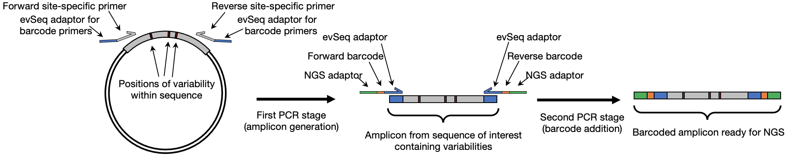

# Library Preparation

The general protocol is as follows:
1. Design and order primers that flank your region-of-interest and will generate a NGS-suitable amplicon.
    - A suitable amplicon is one that is 600 bp or fewer and is thus compatible with the dowstream NGS processing.
    - It should also contain all variability within the region that will be sequenced during the NGS run: for example, if using a paired-end 150 (PE150) protocol, the variable regions should be 150 bp from each end of the amplicon.
    - These primers should include the appropriate `evSeq` adaptor sequences as well (shown in blue above).
2. Use overnight culture from a 96-well plate outgrowth to perform a 96-well PCR with these primers.
    - The plasmid within each culture will act as the template for the PCR.
3. After initial amplicon generation (~10 cycles), add the evSeq primers to append well-specific barcodes to each amplicon.
4. Pool each well of the PCR plate together, purify, and then send for a paired-end NGS run.
    - Multiple purified `evSeq` samples can be further pooled together if using different pairs of `evSeq` dual-index barcodes (barcodes paltes DI01–DI08). This further spreads the NGS reads (and cost) among more variants, allowing up to 768 wells to be sequenced in a single multiplexed NGS experiment.
5. Work up the .fastq files with the `evSeq` software (see [Computation](../index.md#computation)).

## Inner Primer Design

---

*Back to the [main page](../index.md).*