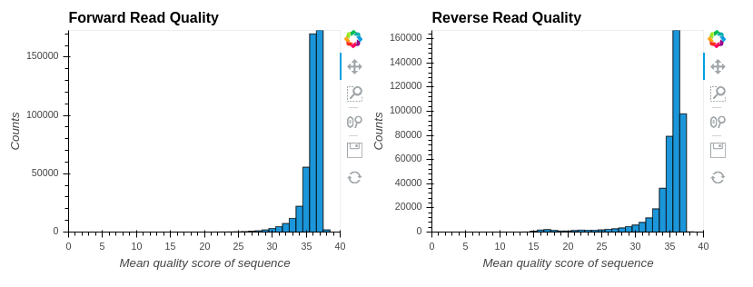
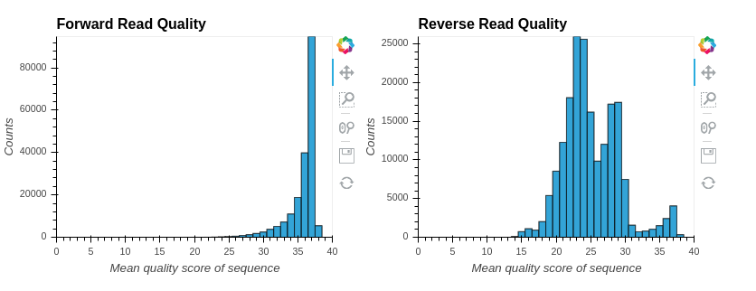
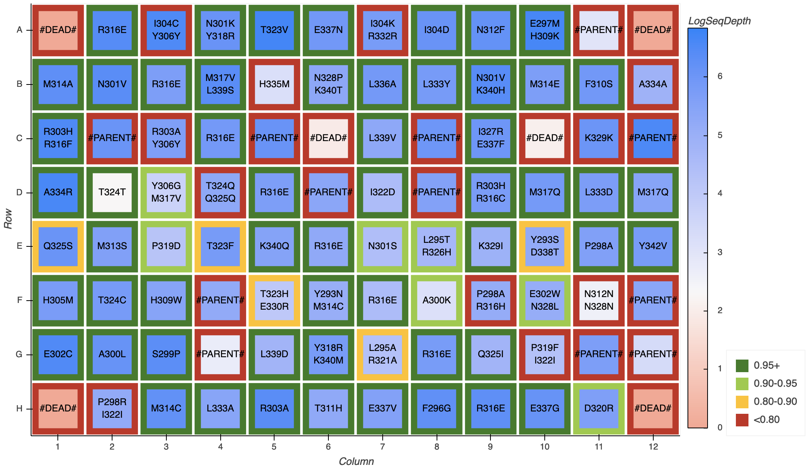

# Understanding the Outputs
The output location of `evSeq` is controlled with the `output` optional argument (see [here](#Optional-Arguments)). If the "output" argument is not set, then evSeq will save to the current working directory (command line) or the `evSeq` Git repository folder (GUI). If the save location has not previously been used, then `evSeq` will create a folder titled `evSeqOutput` in the output location which contains a folder giving the date-time of the run initialization (in `yyyymmdd-hhmmss` format). If the save location has been previously used, then evSeq will add another date-time folder with the previously generated `evSeqOutput` folder. All `evSeq` outputs of a specific run are contained in the associated date-time folder. The below sections detail the folders found within the date-time folder.
## `Qualities`
The `Qualities` folder contains histograms of the forward and reverse read quality scores for the sequencing run prior to any filtering or QC. For information on what the quality score is, see [here](https://www.illumina.com/content/dam/illumina-marketing/documents/products/technotes/technote_understanding_quality_scores.pdf) An example image from the `Qualities` folder is given below:

The example presented results from a good run — as a heuristic, you typically want most reads above 30 in both the forward and reverse direction (though the reverse reads are generally a bit worse). Checking this file is critical, as it gives you insight into how confident you can be in your sequencing results. An example of a bad quality score histogram (specifically the reverse read) is below:

Note that most of the reverse reads have Q-scores below 30. If you have a histogram like this, it's highly likely that something went wrong at some stage of `evSeq` library prep/sequencing. See the [troubleshooting page](../troubleshooting.md#poor-reverse-read-quality) for more details.
## `OutputCounts`
The `OutputCounts` folder contains most tabular information needed for downstream processing after `evSeq` is run. For each run, 8 files will be generated and stored within the `OutputCounts` folder. The files all follow the general format (`[AminoAcids/Bases]_[Decoupled/Coupled]_[All/Max].csv`) and contain information on all variants identified in the run. Any `AminoAcid` file contains information for the mutant amino acids identified while a `Bases` file contains information for the mutant bases identified. `Decoupled` files are the result of counting bases independent of reads (i.e., they do not capture information about how frequently two mutations occur together when considering pair-end sequencing) while `Coupled` files contain the results of counting bases considering paired reads. `All` files contain information on _all_ non-WT variants identified regardless of frequency while `Max` files contain information only on the single most frequent non-WT variant found in each well. **For the purpose of constructing sequence-function pairs, the most useful files are `AminoAcids_Decoupled_Max` and `AminoAcids_Coupled_Max`.** As necessary, the other files (e.g., `AminoAcids_Decoupled_All`) can provide information on mixed populations or other imperfections.

Each `OutputCount` file holds a table with the following information:

| Header | Information Contained|
|:-------|----------------------|
| `IndexPlate` | The index plate used (e.g., `DI01`) |
| `Plate` | User-specified plate name |
| `Well` | Source plate/index plate well|
| `Aligment Frequency` | The fraction of reads corresponding to combination or individual mutant, depending on the specific file |
| `WellSeqDepth` | The total number of reads in a well that passed QC |
| `Flag` | Contains any non-standard information about the variant. A particularly useful flag is `Unexpected Variation`, which is returned for any variant/mutant identified that was not expected according to the provided reference sequence OR in cases where a mixed well is possible. |

In addition to the above information, the `Coupled` files contain the below columns:

| Header | Information Contained|
|:-------|----------------------|
| `VariantCombo` | The identity of any variant identified. Each variant is given in the format `[original character][position in sequence][new character]`, and variants are separated by underscores.|
| `SimpleCombo` | The same information as `VariantCombo`, but only the new character is given. This is a useful shorthand when mutation sites are known. |
| `VariantsFound` | The number of variants identified in the given combination. |
| `VariantSequence` | The `VariableRegion` sequence for the well updated to reflect the identified variant. |

while the `Decoupled` files contain the below columns:

| Header | Information Contained|
|:-------|----------------------|
| `[Aa/Bp]Position` | The position where a variant amino acid or base was found.|
| `[Aa/Bp] `| The identify of the variant amino acid found.|

Note that `evSeq` handles identified parent and dead wells differently from others. Some notes on these "special" outputs:
1. When a parent well is identified (e.g., a well with no variation compared to the reference sequence), the returned values for `VariantCombo` and `SimpleCombo` will be `#PARENT#`. Note the flanking use of "#" to highlight that this is not an amino acid sequence. The returned `AlignmentFrequency` will be given as `1 - variable_thresh` to signify that no variation was found above `variable_thresh` at any position in the sequence. The returned `WellSeqDepth` will be the average count over all positions aligned to the reference. 
2. A "dead" well is one that either has fewer unpaired usable reads passing QC than that given by `variable_count` (in the case of decoupled results), or less paired usable reads passing QC than that given by `variable_count`. If not enough paired reads are present pre-QC, then the number of paired reads identified is returned for `WellSeqDepth`; if not enough reads are present after QC, then the number of reads remaining after QC are returned. In either case, the `WellSeqDepth` should be less than `variable_count`. For dead wells, the `AlignmentFrequency` and `VariantsFound` columns will be given as `0`. Any sequence-related output will be reported as `#DEAD#`, where "#" is again used to avoid confusion with an amino acid sequence.

## `Platemaps`
For each plate passed in via the `refseq` file, an interactive platemap plot will be generated. These platemaps are stored in an html file found in the `Platemaps` folder, which can be opened with any browser. An example image is given below:

As stated, these are interactive and contain toggles (when multiple plates are being analyzed by `evSeq`) and extra information about each well when hovering over them, which can be more readily seen in [notebook].

The text within each well is the combination of amino acids (in 5' -> 3' order, as passed in in the `refseq` file) with the highest alignment frequency for that well. The fill color of the well is the log sequencing depth, while the well border color is the alignment frequency of the well. Note that the border color is binned rather than existing on a continuous scale. Also note that, because the position information is not given, the output csv files in the previous section should be used for downstream processing — these images are simply a nice way to quickly analyze your data.

## `evSeqLog`
`evSeq` keeps a log of every run. A single log is output for each `evSeq` run as `RunSpecificLog.txt` in that run's `evSeqOutput` folder. However, a continuous log is also stored within the local `evSeq` install repository and can be found here: `evSeqLog.log`. Information captured by the log file includes:

1. The start time of the `evSeq` run, given as `yyyymmdd-hhmmss` followed by a series of underscores. This is the first line of each log block.
2. The values of all parameters input to `evSeq`. Note that if parameters are unspecified, the log records the default parameters.
3. Information on files used for processing, including
    1. The forward and reverse read file pairs identified in the `folder` argument
    2. Any files within `folder` that were not matched.
4. Any warnings encountered during the run. These warnings will also be printed to the console during the run.
5. Fatal errors. If the program completed successfully, the last line in the log entry will read "Run completed. Log may contain warnings."

The amount of information stored in the log file is small (bytes per run), but will build with continued use of `evSeq`. If the file gets too large (this will take a long time...) you can delete `evSeqLog.log`; on the next run a fresh `evSeqLog.log` file will be created.

## `ParsedFilteredFastqs`
_Optional; requires `--keep_parsed_fastqs` or `--only_parse_fastqs` flags to be passed._

For each well identified, fastq files containing all forward and reverse reads that passed initial sequencing QC (i.e., their average Q-score is above `average_q_cutoff` and the length of the read is greater than `length_filter`) are generated. For all sequences  returned, barcodes and adapter sequences are stripped from the returned reads, meaning that they represent only the sequencing region that covered the amplicon. These files can be used for further downstream processing by software other than deSeq. Note that only paired reads are returned (i.e., if one partner in a forward-reverse pair failed initial QC, neither is returned in these fastq files).

## `Alignments`
_Optional; requires `--return_alignments` argument to be passed._

For each well in the run, a text file is generated containing every alignment of sequences that passed initial QC. Alignments for sequences that did not pass QC (either because their average Q-score was below `average_q_cutoff` or the length of the read fell below `length_filter`) are not included. 

The alignment file is ordered in blocks of paired forward and reverse reads. Each block begins with "Alignment #:", followed by a forward alignment and/or a reverse alignment. Note that if a sequence did not pass QC, its alignment is not included in the block; if both sequences in a pair did not pass QC, then no alignments are reported, **BUT** a header ("Alignment #") is still made in the file. The rational for including a header is to allow the user to see how many sequences could have potentially been aligned versus how many were capable of being aligned based on set QC parameters.

Note that just because an alignment is present in these files, it does not mean that it was used for analysis, sequences that pass initial QC will not necessarily pass alignment QC. In particular, any returned sequence that shows an insertion or deletion is automatically discarded and not used for analysis. The alignment files can be used to identify sequences that likely have insertions or deletions present.

---

*Back to the [main page](../index.md).*