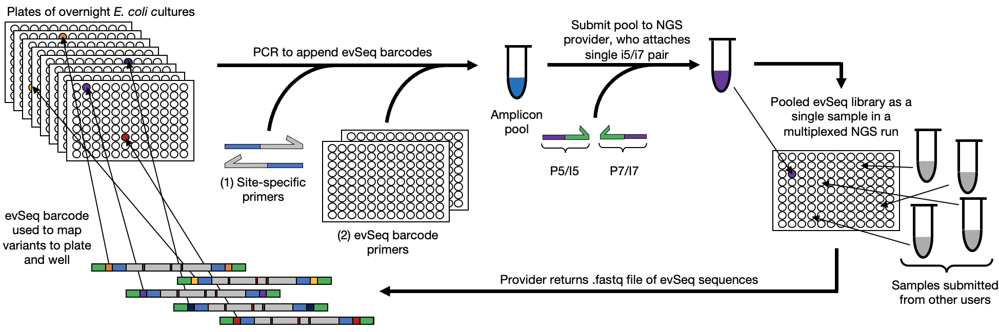

## Every Variant Sequencing: No sequence-function pair left behind.

Every Variant Sequencing (`evSeq`) provides resources for extremely low cost massively parallel sequencing of protein/enzyme variants arrayed in 96-well plates. This library preparation technique and data processing tool enables sequencing all variants produced during a protein engineering or biochemical mutagenesis experiment at a cost of cents per variant, even for labs that do not have expertise in or access to next-generation sequencing (NGS) technology.

[Read the paper!](one_day...)

### Overview
#### Workflow

#### Example Output (1 of 8 plates)

## Documentation
### Biology
#### [Theoretical overview](bio/theory.md)

#### [Library preparation](bio/lib_prep.md)
- [Inner Primer Design](bio/lib_prep.md#inner-primer-design)
- [PCR Protocol](bio/lib_prep.md#pcr-protocol)
- [PCR Product Purification](bio/lib_prep.md#pcr-product-purification)

### Computation
#### [Programming basics](comp/basics.md)
#### [Installation](comp/installation.md)
- [Installing from GitHub](comp/installation.md#installing-from-github)
- [Installing with PyPI (pip)](comp/installation.md#installing-from-pypi)
- [Using the `evSeq` environment](comp/installation.md#using-the-evseq-environment)
#### [Running `evSeq`](comp/usage.md)
- [Post Installation](comp/usage.md#post-installation)
- [The `refseq` file](comp/usage.md#the-refseq-file)
- [Using `evSeq` from the command line or GUI](comp/usage.md#using-evseq-from-the-command-line-or-gui)
- [Using `evSeq` in a Python environment](comp/usage.md#using-evseq-in-a-python-environment)
- [Optional Arguments](comp/usage.md#optional-arguments)
#### [Understanding the outputs](comp/outputs.md)
- [Qualities](comp/outputs.md#qualities)
- [Summaries](comp/outputs.md#summaries)
- [Platemaps](comp/outputs.md#platemaps)
#### Additional tools
- Mapping sequence to function

### Troubleshooting
- Poor reverse read quality
- Poor alignments but good quality
