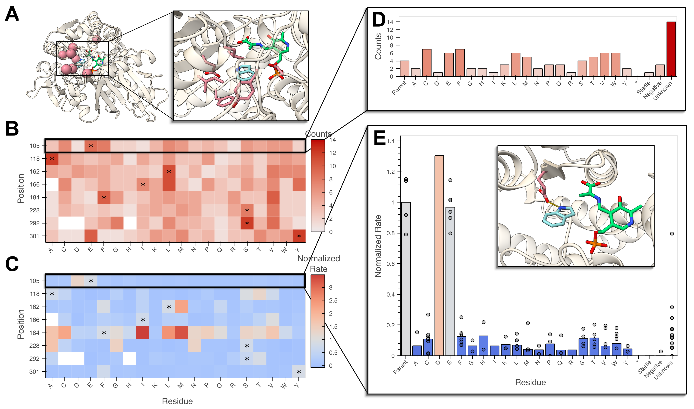

## Every Variant Sequencing: No sequence-function pair left behind.

Every Variant Sequencing (`evSeq`) is a library preparation and analysis protocol designed to slot neatly into existing protein engineering workflows to enable extremely low cost massively parallel sequencing of heterologously expressed protein variants arrayed in 96-well plates. This workflow enables sequencing all variants produced during a protein engineering or biochemical mutagenesis experiment at a cost of cents per variant, even for labs that do not have expertise in or access to next-generation sequencing (NGS) technology.

### Read the Paper!
This repository accompanies the work ["evSeq: Cost-Effective Amplicon Sequencing of Every Variant in Protein Mutant Libraries"](LINK_TO_PAPER). If you use this tool, please [cite us](LINK_TO_PAGE_WITH_CITATION_FORMATS).

### Read the Docs!
Navigate to [individual pages below](#documentation) or [start at the overview](0-theory.md).

### General Overview
#### The `evSeq` workflow

**A)** Laboratory procedure. **B)** Computational procedure.

#### Construct and visualize sequence-function pairs

Sequencing eight site-saturation libraries (768 wells) in a single `evSeq` run and combining this with activity data to create low-cost sequence-function data. **A)** Enzyme and active-site structure highlighting mutated residues. **B)** Heatmap of the number of identified variants/mutations ("counts") for each position mutated ("library") from processed `evSeq` data. **C)** Heatmap of the average activity ("normalized rate") for each variant/mutation in each library. **D)** Counts for a single library, also showing the number of unidentified wells. **E)** Activity for a single library, showing biological replicates. (Inset displays the mutated residue in this library.)

## Documentation
### Biology
#### [Theoretical overview](0-theory.md)

#### [Library preparation](1-lib_prep.md)
- [Dual-Index Barcode Plates](1-lib_prep.md#dual-index-barcode-plates)
- [Inner Primer Design](1-lib_prep.md#inner-primer-design)
- [Inner Primer Test PCR](1-lib_prep.md#inner-primer-test-pcr)
- [PCR Protocol](1-lib_prep.md#pcr-protocol)
- [PCR Product Purification](1-lib_prep.md#pcr-product-purification)

### Computation
#### [Computational basics](2-basics.md)
#### [Installation](3-installation.md)
- [Installing from GitHub with the `conda` environment](3-installation.md#installing-from-github-with-the-conda-environment)
- [Standard `pip` Install and Dependencies](3-installation.md#standard-pip-install-and-dependencies)
#### [Running `evSeq`](4-usage.md)
- [Post Installation](4-usage.md#post-installation)
- [Using `evSeq` from the command line or GUI](4-usage.md#using-evseq-from-the-command-line-or-gui)
- [Required Arguments](4-usage.md#required-arguments)
  - [The `refseq` file](4-usage.md#the-refseq-file)
  - [`folder`](4-usage.md#folder)
- [Optional Arguments](4-usage.md#optional-arguments)
#### [Understanding the Outputs](5-outputs.html)
- [`Qualities`](5-outputs.html#qualities)
- [`OutputCounts`](5-outputs.html#outputcounts)
- [`Platemaps`](5-outputs.html#platemaps)
- [`evSeqLog`](5-outputs.html#evSeqLog)
- [`ParsedFilteredFastqs`](5-outputs.html#parsedfilteredfastqs)
- [`Alignments`](5-outputs.html#alignments)

### Additional Examples
Below are a collection of Jupyter Notebooks (rendered as documents) with examples on how to get the most out of `evSeq`. If you want to run them on your own, they can be found in the [examples](../examples/) directory of the `evSeq` repository.
#### [Using `evSeq` data](6-using_evseq_data.html)
- [Importing and viewing `evSeq` data](6-using_evseq_data.html#importing-and-viewing-evseq-data)
- [Pairing sequence to function](6-using_evseq_data.html#pairing-sequence-to-function)
- [Analyzing single-site-saturation libraries](6-using_evseq_data.html#analyzing-single-site-saturation-libraries)
- [`evSeq` for multisite libraries](6-using_evseq_data.html#evseq-for-multisite-libraries)
- [Creating figure-worthy visualizations](6-using_evseq_data.html#creating-figure-worthy-visualizations)
- [Submitting to Protαβank and other databases](6-using_evseq_data.html#submitting-to-protαβank-and-other-databases)
- [Miscellaneous visualizations](6-using_evseq_data.html#miscellaneous-visualizations)

#### [Creating barcode/index pairs](7-index_mapping.html)
- [Using new barcode primers](7-index_mapping.html#using-new-barcode-primers)
- [Creating new index pair mappings](7-index_mapping.html#creating-new-index-pair-mappings)

#### [Running evSeq in a Jupyter Notebook](8-full_demo.html)
- To run this notebook on your own, open it in the `evSeq` repository and run it from its current location (found as [evSeq/examples/8-full_demo.ipynb](../evSeq/examples/8-full_demo.ipynb))

### Troubleshooting
- [Poor reverse read quality](9-troubleshooting.md#poor-reverse-read-quality)
- [Poor results but good quality sequencing](9-troubleshooting.md#poor-results-but-good-quality-sequencing)
- [Windows: `CommandNotFoundError: Your shell has not been properly configured to use 'conda activate'`](9-troubleshooting.md#windows-commandnotfounderror-your-shell-has-not-been-properly-configured-to-use-conda-activate)
- [macOS: `PermissionError: [Errno 1] Operation not permitted`](9-troubleshooting.md#macos-permissionerror-errno-1-operation-not-permitted)
